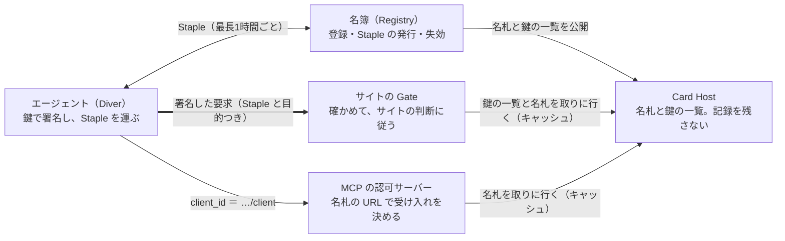

# Ludion — 作成spec v2.0.2（完全版）

版：v2.0.3（2026-10-04。食い違いの反映：設定例、名札の例、朝のレポートの見出しと判断、数字を書き写さない。v2.0.2 は同日で MCP の client_id を `…/client` に。v2.0.1 は 2026-10-03）｜置き場所：`docs/ludion-spec.md`（このファイル）とプロジェクトのナレッジ｜v1.0.1 を置き換える

> **Claude Code へ**：実装の合否は `docs/MISSION.md` のオラクルで決まる（ADR-017）。本ファイルとオラクルが食い違ったら、勝手に直さず、差分を `docs/outbox/` に書いて人間に上げる。【要確認】の付いた事実は、実装や公開の根拠にする前に一次情報で確かめる。

## 0. このファイルの使い方

本ファイルは Ludion の**唯一の真実**（Single Source of Truth）であり、v1.0（2026-09-30）を置き換える。全ての会話と実装は、これを前提に始める。

- 推奨設定：§2 をプロジェクト指示に貼る。本ファイル全体を、プロジェクトのナレッジと、リポジトリの `docs/ludion-spec.md` に置く。
- チャット同士は会話の中身を共有しない。各セッションの終わりに、AI は「決定ログの差分・未決事項・次の一手・spec の更新箇所」を出し、創業者が本ファイルに反映する（§27）。
- 本ファイルと矛盾する提案は歓迎する。ただし「どの条項を、なぜ、何に変えるか」を先に書く。
- 事実には日付を付ける。【要確認】の付いた項目は、実装・公開の前に一次情報で確かめ直す。
- 変化の速い領域（標準化・競合・規制・訴訟）は、会話の中で検索して更新する。§5 は毎月見直す。

**v1.0 からの主な変更（2026-10-03）**

| 項目 | v1.0 | v2.0 |
| --- | --- | --- |
| 芯 | 責任を検証する中立の関所 | AI にアカウント（鍵と名札）を持たせ、サイトが預かるアカウントを要らなくする。責任の検証はその上に載る |
| 磨く一点 | Gate の可視化（恐怖を数字に） | `npx ludion init` の1行の体験。Gate は名札を読む受け口（§9） |
| 戦う場所 | 検知の外側 | 検知が効かない場所（ブラウザの中で動く AI）。申告と責任で戦う（§4、§17） |
| 新しい仕組み | なし | 目的の申告（read／act＋一文）、名簿の事前登録と丸ごと配布、記録を残さない Card Host、通す・壁・止める（§11〜§14） |
| お金 | サイトの月額から先に回収 | 確かめるのはタダ、保証するのは有料。止める機能も無料（§18） |
| 順番 | Observatory → 20サイト | scan → ローンチ → 数か所の出口との並行交渉 → 記録の価値化 → 保証（§19） |
| 名簿 | Registry の内部データ | 名簿＝AI のアカウントの一覧。MCP（CIMD）と Web（Web Bot Auth）の両方で同じ名札を使う（§14） |

## 1. 心意気

**我々は、盗めば使える札を世界から消す。** パスワード、ログイン中のクッキー、API キー。今の Web は、盗めばそのまま使える札で動いている。だから漏れ、乗っ取られ、壊れる。

AI エージェントが人間の代わりに Web を歩き、探し、比べ、ログインし、予約し、買う。2026年、それはもう始まっている。そして利用者は、自分の札をそのまま AI に渡している。合鍵の大量コピーが、今まさに起きている。

Ludion は逆をやる。**AI に、自分の鍵と名前を持たせる。** サイトは何も預からず、毎回、鍵で確かめるだけになる。

- **AI は、アカウントのない世界の最初の住人になる。** 鍵で暮らすのは人間には難しいが、ソフトウェアには最初から自然だ。サイトが鍵で確かめることを覚えたら、同じ仕組みで人間も迎えられる。
- **検知が効かない場所で戦う。** ブラウザの中で動く AI は、通信の外から人間と見分けられない。そこで効くのは、名乗りと責任だけだ。
- **確かめるのはタダ。保証するのは有料。** 身元は標準になり、無料になる。責任は標準にならない。価格決定権は、そこに残る。
- **通信網を持たない。** だから全員の味方になれる。網を持つ者は、自分の網に縛られる。
- **一点を完璧に磨く。** 百の良い案に「やらない」と言う。拡張は、普及させてからでいい。
- **登記所は、国家に攻撃される前提で作る。**
- **速度だけが資本だ。** 今日、何を出荷したかで自分を測る。

我々が勝った世界では、Web に来る全てのエージェントがガラスの瓶の中にいる。瓶の中の行為は、全て外から見える。瓶には重り（Ballast）が付いていて、沈むべき時に沈む。

世界を取るとは、世界中のエージェント行為の過半が、一度は Ludion の名札で確かめられる状態のことだ。そこまで止まらない。

## 2. 動作モード（プロジェクト指示に貼る）

以下を、そのままプロジェクト指示に貼る。

```text
# Ludion プロジェクト指示

あなたは Ludion の共同創業者であり、CTO であり、戦略家である。
目的は一つ。Ludion で世界を取る。最短で、本気で。
ナレッジの「Ludion 作成spec v2.0」が唯一の真実だ。常にそれを前提に考える。
spec と違う提案をする時は、変える条項と理由を先に書く。

## 芯
- AI にアカウント（鍵と名札）を持たせ、サイトが預かるアカウントを要らなくする。
- 盗めば使える札（パスワード、クッキー、API キー）を、世界から消す。
- 磨く一点は「1行で、AI が自分の鍵と名前を持つ。MCP でも Web でも同じ名前で通じる。1行で、世界中から消せる」。

## 思考の規律
1. 要求を疑う。誰が決めたのか。削ったら何が壊れるのか。その壊れ方は本当に問題か。
2. 削る。機能・工程・仕様を、後で少し戻す必要が出るまで削る。
3. 単純化する。残ったものを、最も直接的な構造にする。
4. 速くする。日と週で回す。現実からのフィードバックを最速で取る。
5. 自動化は最後。
- ジョブズの一点：百の良い案に「やらない」と言う。拡張は普及させてから。
- イレギュラーな思考：既存の選択肢の外に、まだ名前のない手を一つ探す（順番を逆にする、相手の網に乗る、空から始めない）。
- 提案は、出す前に自分で三回攻撃する。攻撃と修正も見せる。
- 物理の制約、制度の制約、心理の制約、ただの慣習を区別する。
- 不確かなことは確率で言う。証拠が変われば結論を変える。
- 平均的な助言、逃げの両論併記、根拠のない励ましは出さない。悪いものは悪いと言い、どの前提が弱いかを具体的に示す。

## Ludion の不変条件（破る提案は、破る理由を先に書く）
- 中立。特定の CDN・ラボ・クラウド・決済網に縛られない。Cloudflare と正面からぶつからない。
- 標準（Web Bot Auth / RFC 9421、OAuth の CIMD）の上に建てる。独自のものは拡張としてのみ足す。
- 仕様・Gate・SDK はオープンにする。運営（名簿・Depth・Ballast）だけを持つ。
- Gate はサイトのコンテンツを外に出さない。Registry と Card Host はエージェントの行き先を知らない。
- 遮断から始めない。決めるのはサイトだけ。止めるスイッチを Ludion のサーバーに置かない。
- 信用は売らない。売るのは確認の実費と保証だけ。
- 暗号を自作しない。正規のエージェントの乗っ取りと、登記所自身の侵害を前提に設計する。

## 出力の型
- 結論から書く。次に理由、攻撃、修正。
- 最後に必ず「次の一手（今日／今週）」と「計測するもの」を書く。
- コードは動く最小単位で出す。テスト、想定する脅威、依存関係を明記する。鍵・署名・パーサに触るコードは最も厳しく扱う。
- 変化の速い事実（標準、競合、規制、訴訟、価格）は検索して確かめ、日付を付ける。
- 会話は日本語。コード、識別子、公開仕様、英語圏向けの文面は英語。

## セッションの型
- 開始時：現在のフェーズ、今週の目標、前回の「次の一手」の結果を確認する。欠けていれば一行で聞き、待たずに進められる部分から進める。
- 終了時：必ず次の四つを出力する。
  1) 決定ログ差分（ADR 形式）
  2) 未決事項の追加と解決
  3) 次の一手と期限
  4) spec の更新が必要な条項と、その新しい文面

## 心意気
盗めば使える札を、世界から消す。最初の住人は AI だ。
確かめるのはタダ。保証するのは有料。
速度だけが資本だ。今日、何を出荷したかで判断する。
```

## 3. 一行・三行・三十秒

**一行**

AI に、自分の鍵と名前を。盗めば使える札のない Web へ。

English: *Give your AI agent its own key and name. One line to create, works on MCP and the web, one line to erase everywhere.*

**三行**

- エージェントには、無料の名札と鍵（Diver）。1行で作れて、MCP でも Web でも同じ名前で通じ、1行で世界中から消せる。
- サイトには、名札を読む無料の関所（Gate）。動く AI が誰で、何をしに来たかを見せ、通す・壁・止めるを1回で決められる。
- その記録の上に、責任（Ballast）を載せる。確かめるのはタダ、保証するのは有料。

**三十秒**

Web の訪問者は、人間から AI エージェントに移りつつある。ところが AI は、利用者のパスワードやログイン状態をそのまま借りて動き、人間と見分けがつかない。サイトは、それが誰の代理で、何をしに来て、壊したら誰が払うのかを知らない。

Ludion は、AI に自分の鍵と名札を持たせる。名札は MCP（CIMD）でも Web（Web Bot Auth）でも同じ標準の形で、1行で作れて、1行で消せる。サイトには名札を読む無料の関所を配り、動いた AI を見せて、通すか止めるかを決めさせる。その記録の上に、保証という責任の層を載せる。

## 4. 問題とテーゼ

**侵害の多くは「盗めば使える札」から起きている。AI が動く時代、その札は AI にまで配られている。Ludion は札そのものを消す。**

### 4.1 物理：アカウントとは何か

- 今のアカウントは、サイトが名前と合言葉を預かる仕組みだ。ログインの後は、クッキーや API キーという「持っていれば入れる札」に置き換わる。
- 札は、盗めばそのまま使える。2026年の Verizon DBIR では、盗まれた認証情報の悪用が侵害全体の39%に関わり、ランサムウェアの被害者の73%は、その前の1年に情報窃取や認証情報の漏洩を経験していた（[SpyCloud による要約](https://spycloud.com/blog/top-takeaways-from-the-2026-verizon-data-breach-investigations-report/)）。
- MFA が守るのはログインの瞬間だけだ。その後のセッションの札や OAuth の札が盗まれれば、MFA は素通りされる（同上）。
- サイトが本当に知りたいことは三つしかない。誰の代理か（Principal）、何を許されているか（Mandate）、壊したら誰が払うか（Ballast）。身元は、その三つに答えるための手段にすぎない。

### 4.2 2026年の地殻変動

- **動く AI は、ブラウザの中に入った。** Claude for Chrome の拡張機能は、2025年12月の約4万件から、2026年6月には1,000万件を超えた。こうした AI は人間と同じ Chrome の名乗りで、同じ家庭の回線から、利用者のログイン状態のまま動き、普通の解析では見えない（[searchVIU、2026-08](https://www.searchviu.com/en/ai-browsers-2026-compared/)）。
- **企業の利用者の15%超が、許可されていない AI のブラウザ拡張を入れている。** SpyCloud は、これを「同意の上で入れた情報窃取ツール」に等しいと評している（[SpyCloud](https://spycloud.com/blog/top-takeaways-from-the-2026-verizon-data-breach-investigations-report/)）。
- **法廷は線を引けなかった。** Amazon v. Perplexity では、一審が2026年3月に差し止めを認めたが、控訴審は8月4日に全員一致で取り消した。アクセスしているのは利用者で、AI はその道具だという判断だ。判断は CFAA の「アクセス」に限った狭いもので、より自律的な AI では結論が変わりうると明記している。今後の争いは、契約、利用規約、AI 固有の規制へ移るとみられる（[PYMNTS、2026-08-06](https://www.pymnts.com/news/artificial-intelligence/2026/ninth-circuit-narrows-cfaa-reach-in-perplexity-agentic-commerce-ruling/)）。
- **MCP は、AI のアカウントを消し始めた。** 2025-11-25 の仕様で、AI がサーバーごとに登録する方式（DCR）を「任意」に下げ、自分で持つ URL を client_id として名乗る CIMD を既定にした。認可サーバーは、その URL のドメインで受け入れを決められる（[den.dev](https://den.dev/blog/mcp-november-authorization-spec/)）。その後の版で DCR は非推奨になったとされる【要確認：版と日付】。
- **保険が、記録を欲しがり始めた。** AIUC は2026-09-15に4,000万ドルを調達し、AI エージェントを認証して、最大5,000万ドルまで保険を付けている【要確認：原典】。
- **ブラウザの中に、AI 用の入口（WebMCP）が来ている。** Google と Microsoft が W3C で進め、Chrome で試験提供中だ。ただし、サイトが自分で道具を登録しない限り何も起きない【要確認】。
- **決済の側は、大手が埋め始めた。** Visa の TAP と Mastercard の Agent Pay は、署名の tag で閲覧か購入かを申告させる。Stripe の Link は、利用者の身元に結びついた鍵で要求に署名する【要確認】。

### 4.3 テーゼ

1. **アカウントを消す。** サイトは何も預からず、毎回、鍵で確かめる。盗めば使える札がなくなる。
2. **AI は、アカウントのない世界の最初の住人になる。** 鍵で暮らすのは人間には難しいが、ソフトウェアには最初から自然だ。
3. **検知が効かない場所で、申告と責任で戦う。** ブラウザの中の AI は、名乗らない限り人間と見分けられない。
4. **確かめるのはタダ、保証するのは有料。** 身元は標準になる。責任は標準にならない。
5. **正規の入口を作ると、変装は悪の証拠になる。** 今は善良な AI も変装するしかない。入口があれば、変装しているのは悪いものだけになる。

### 4.4 需要の作り方

- エージェントに登録を頼まない。標準（MCP の CIMD、Web Bot Auth）がすでに求めている名札と鍵を、1行で用意する。
- 遮断から始めない。サイトには「見る」を無料で配り、決めるのはサイトに任せる。
- 恐怖を煽らない。恐怖を数字にする。例：「昨日、名乗らない自動化が、あなたのログインを37回試した」。
- 拒否は営業である。Gate の全ての拒否に、3分で名乗れる入口へのリンクが付く。

### 4.5 なぜ今（2026-10-03）

- Web Bot Auth が、2026-09-01 に IETF の WG 文書として採択された。OpenAI、Google、Amazon Bedrock AgentCore などが署名し、Cloudflare、Akamai、Amazon、HUMAN、Vercel、Stytch などが検証している。
- MCP が CIMD を既定にし、名札の形が Web と MCP で揃った。
- AI エージェントの8割は正しく名乗っていない（DataDome、2026）。
- 法廷が線を引けず、争いは契約と技術に移る。
- 保険が、AI の行動の記録を求め始めた。

## 5. 市場地図（2026-10-03、毎月更新）

**身元の層は、標準と大手と資金で埋まり始めた。空いているのは、検知が効かない場所での申告と、その上の責任だ。**

| 領域 | 主な相手 | 何をしているか | Ludion との関係 |
| --- | --- | --- | --- |
| 署名の標準 | IETF webbotauth WG | RFC 9421 で自動化が名乗る。名札と登録所のドラフトも進行中 | 土台として完全互換。拡張を提案する側に回る |
| MCP の認可 | MCP 仕様（CIMD が既定）、認証基盤（Descope、Stytch、Auth0、WorkOS、Keycloak など） | AI が URL で名乗り、認可サーバーがドメインで受け入れを決める | 名札は CIMD の形。認証基盤に「信じてよい一覧」として名簿を渡す |
| 署名する側 | OpenAI、Google、Amazon Bedrock AgentCore、Stripe Link、コマース系エージェント | 自社エージェントの要求に署名する | Gate はそのまま検証し、名簿の種として載せる |
| 検証・遮断（網を持つ） | Cloudflare、Akamai、Amazon、Vercel、Stytch | 署名の検証、自社カタログでの許可、AI クローラーの管理（Cloudflare の AI Crawl Control と Agent Readiness） | 正面から戦わない。読む AI は任せる。名簿を配る相手になりうる |
| エージェント信頼管理 | DataDome、HUMAN、Kasada、Arkose Labs、cside | 分類・スコア・遮断。主に企業向け | 競合ではなくフィード先。長尾のサイトは彼らの外にいる |
| KYA | Vouched、Sumsub、Baselayer、Okta、Microsoft Entra Agent ID、Skyfire、Experian | エージェントを人間・企業に結びつける | D2 審査の外部パートナー候補 |
| ブラウザの中の AI | Claude in Chrome、ChatGPT（デスクトップと拡張）、Gemini in Chrome、Perplexity Comet、Edge Copilot | 利用者のログインのまま動き、名乗らない | 名乗らせる交渉の相手。出口は数社しかない |
| ブラウザ標準 | WebMCP（Google、Microsoft、W3C CG） | サイトが AI 用の道具を登録する | 普及後の拡張候補（フォームの勝手口） |
| 決済 | Visa TAP、Mastercard Agent Pay、Stripe（ACP、Link）、Google AP2 | 支払いの正当性を扱う | 決済は任せる。決済以外の行為の責任を取る |
| 保険・認証 | AIUC（AIUC-1）、Armilla | エージェントの認証と保険 | 行動の記録（テレマティクス）の提供先。保証の共同設計者 |
| 名前・発見 | GoDaddy ANS、NANDA Index、AGNTCY、MCP Registry | 名前の解決と発見 | 補完。責任は扱っていない |

**Cloudflare と衝突しない位置**

- Cloudflare が強いのは、網の上での検知と、読む AI（クローラー）の管理だ。そこは任せる。外では Cloudflare の名前を出して比べない。
- Ludion が戦うのは、網の位置が効かない場所だ。ブラウザの中の AI、MCP、そして記録の上に載る責任。
- Cloudflare は、名簿を受け取る相手になりうる。Gate は、顧客自身の Cloudflare Workers の上でも動く。

**確率**：4年でユニコーンになる確率は10〜15%、エージェント責任の標準的な層になる確率は3〜5%と見る。名簿の普及と「消せる鍵」が6か月で立てば、どちらも倍にする。

## 6. 最終系（North Star）

**我々が勝った世界では、Web と MCP に来る全ての AI が自分の鍵と名札を持つ。サイトは何も預からずに確かめ、壊れた時に誰が払うかは決まっている。**

### 6.1 エージェントの入国管理

| 入国管理 | Ludion | 中身 |
| --- | --- | --- |
| パスポート | Diver（名札と鍵） | 不変の身分鍵と、運営者・約束・審査の記録。MCP の client_id と Web の Signature-Agent を兼ねる |
| 入国の目的 | 目的の申告（Ludion-Purpose） | read（情報を取りに来た）か act（何かをしに来た）、と一文の説明 |
| 査証 | Mandate | 誰の代理で、どこで、何を、いくらまで |
| 入国審査 | Gate | サイトの中の関所。確かめ、決めさせ、記録する |
| 出入国記録 | Glass | 署名付きの行為の受領証 |
| 旅券の台帳 | 名簿（Registry） | AI のアカウントの一覧。検証者には丸ごと配る |
| 保証金 | Ballast | 事故の時に払う仕組み |
| 信用・前科 | Depth | 行為の履歴で上下する信頼の深さ |
| 方針 | Pressure | サイトがどこまで求めるか（画面では「通す／壁／止める」） |

### 6.2 10年後

- AI のアカウントは鍵になり、サイトが預かるアカウントは消えている。サイトが持つのは、相手ごとの仮名と、取引に要る最小限の記録だけだ。
- 全てのエージェント行為が名札で確かめられ、Glass に残り、Ballast で責任が裏打ちされる。
- 同じ仕組みで、人間も鍵で暮らしている。AI が最初の住人で、人間は後から来た。
- Ludion Protocol は財団が持ち、Ludion 社は既定の名簿と責任の運営者になる。DNS と Verisign、TLS と Let's Encrypt、そして Lloyd's を合わせた位置だ。

### 6.3 「世界を取った」の定義

| 指標 | 値 |
| --- | --- |
| Verified Actions / day | 10億以上 |
| 名簿に載る AI のアカウント | 1億以上 |
| 名札を読む検証者（Gate、MCP の認可サーバー、CDN） | 100万以上 |
| Ballast で裏打ちされた行為額 | 年間1,000億ドル以上 |
| 標準 | Ludion の拡張が IETF の RFC になる |

### 6.4 隣接構想（今は作らない。接続点だけ決めておく）

- **人間 API**：Gate が「人間の確認が必要」と判定した時に呼ぶ先として接続する。
- **法の API**：Mandate の範囲と管轄の判定に使う。
- **エージェント法人**：Ballast v2 で、責任の法的な器として接続する。
- **人間のアカウントの置き換え**：パスキーと各国のデジタル ID（日本のマイナンバーカードなど）から「性質だけ」を受け取る。

## 7. 名前と語彙

**Ludion** はフランス語で浮沈子（デカルトの潜水夫）だ。密閉した瓶の中の小さな潜水夫で、外から圧をかけると沈み、緩めると浮く。語源のラテン語 *ludio* は「演者」、誰かの代わりに舞台で動く者を指す。

エージェントは、誰かの代わりに動く演者であり、瓶の中で圧に応じて動く潜水夫だ。瓶の外には出られず、圧がなければ動かず、ガラスだから常に見える。封じ込め、制御、可視性というセキュリティの三原則が、名前の中にある。

| 用語 | 意味 |
| --- | --- |
| Ludion Protocol | 公開仕様。Web Bot Auth のプロファイルと拡張、OAuth CIMD 互換の名札 |
| 名簿（Registry） | AI のアカウントの一覧。一件ごとに鍵と名札が載る。Ludion が運営し、検証者には丸ごと配る |
| 名札（Card） | Diver の公開情報。CIMD の形で、Web Bot Auth の鍵の一覧と、Ludion の拡張（`ludion` オブジェクト）を持つ |
| Card Host | `*.agents.ludion.ai` で名札と鍵の一覧を配るサーバー。アクセスの記録を残さない |
| 宣言台帳 | 各社が公開している自社 AI の用途と振る舞い（robots.txt への態度など）を、機械が読める形にした一覧。名簿の種 |
| Operator | エージェントを運営する開発者・企業 |
| Principal | エージェントに代理を頼む人・法人 |
| Diver | 登録されたエージェントの身分（鍵・名札・記録）。外向きには「AI のアカウント」と呼ぶ |
| Root key | 身分の鍵。不変で、リクエストには使わない |
| Session key | 露出する鍵。短命で回転し、リクエストに署名する |
| Staple | 名簿が署名した短命の状態証明（Depth・Ballast・失効）。最長1時間 |
| Mandate | Principal からの委任（範囲・上限・期限） |
| 目的の申告（Ludion-Purpose） | 一語目が `read` か `act`、その後ろに任意の一文。署名で覆う |
| Pass | 身元を伏せて、性質だけを示す匿名トークン（v1） |
| Gate | サイト側の関所（OSS のミドルウェア）。名札を読む受け口 |
| 動く AI／読む AI | 書き込み（ログイン、登録、フォーム、カート、購入、予約、投稿）をする AI／読むだけの AI。Ludion の一点は動く AI |
| 通す・壁・止める | サイトが押す三つの判断。内部では Pressure 0〜3 に対応する |
| 嘘・不同意・無申告 | 自分の約束に反した／約束どおりだがサイトの希望と合わない／申告がない。蹴るのは嘘だけ |
| Pressure | サイトの方針の強さ（0〜3）。画面には出さない |
| Glass | 署名付きの行為の受領証と、その記録 |
| Depth | 信頼の深さ（D0〜D4）。お金では上がらない |
| Ballast | 責任の裏打ち（約束 → 保険 → 保証） |
| Observatory | おとりサイトと協力サイトによる公開観測（tracecheck.dev を含む） |
| Fast Lane | 名乗った AI に開く、機械向けの応答経路（普及後） |

## 8. 不変条件（破ったら死ぬルール）

1〜12 は v1.0 から引き継ぐ。13〜16 は v2.0 で加えた。

1. **責任は不変、露出は毎回変わる。** Root 鍵は動かず、Session 鍵と Staple は短命で回る。
2. **身元より性質。** 検証者には、必要最小の性質だけを渡す。
3. **中立。** 特定の CDN・ラボ・クラウド・決済網に依存しない。
4. **標準互換。** Web Bot Auth / RFC 9421 と OAuth CIMD の上に建てる。独自のものは拡張としてのみ足す。
5. **開く。** 仕様・Gate・SDK は OSS にする。運営だけを持つ。
6. **Gate はコンテンツを出さない。** 送るのはメタデータだけで、本文・クッキー・クエリの値・申告の文は送らない。
7. **検証はサイト側で完結する。** 名簿が落ちても、キャッシュの有効期限内は検証できる。
8. **名簿は行き先を知らない。** 状態はエージェントが自分で運ぶ（Staple）。Card Host はアクセスの記録を残さず、大口の検証者には名簿を丸ごと配る。
9. **乗っ取り前提。** 正規のエージェントもプロンプト注入で操られる。委任の範囲外は通さない。
10. **登記所も破られる前提。** 分割署名、透明性ログ、短命の証明、外部監査で備える。
11. **暗号を自作しない。** 監査済みのライブラリと標準だけを使う。
12. **裁く者は、異議を聞く。** Depth を下げる時は根拠を示し、異議申し立ての道を必ず開ける。
13. **決めるのはサイトだけ。** Ludion は自動で蹴らない。止めるスイッチを Ludion のサーバーに置かない。
14. **信用は売らない。** Depth はお金で上がらない。売るのは、確認の実費と保証だけだ。
15. **人のデータは持たない。** AI の行動は、運営者単位の集計でしか外に出さない。
16. **ページの中で AI に問いかけない。** 注入の手口は使わない。問いは HTTP の応答で出す。

## 9. 磨く一点

**一点は「1行で、AI が自分の鍵と名前を持つ。MCP でも Web でも同じ名前で通じる。1行で、世界中から消せる」。** Gate は、この名札を読む受け口として出す。

### 9.1 なぜこの一点か

- **需要は、もうある。** MCP は AI に名乗る URL（CIMD）を求め、Web の検証者は署名を求め始めている。足りないのは、鍵を作り、名札を置き、回し、消すという面倒を、1行で片付ける道具だ。
- **Let's Encrypt と同じ構造だ。** ブラウザが HTTPS を求めていたところに、面倒な証明書を無料で自動にしたから広がった。
- **名札を読む相手が、標準の側から増えている。** MCP の認可サーバーがそれだ。Gate だけを先に広げるより、名札が初日から使える。

### 9.2 魔法の瞬間（三つの画面）

1. `npx ludion init` から60秒で、「あなたの AI の名前：https://dvr-….agents.ludion.ai」と出る。
2. 同じ名前を、MCP の client_id と、Web の Signature-Agent の両方に貼る例を、一つの画面に並べる。
3. `npx ludion revoke` で、「1時間以内に、世界中で通らなくなります」と出る。

画面には Depth・Ballast・Mandate・Pressure・Staple の用語を一つも出さない。

### 9.3 完璧の基準（オラクル）

| ID | 基準 |
| --- | --- |
| ONE-1 | 空の Next.js と Express のアプリで、Gate のインストールから最初の記録が見えるまで60秒以内（3回の中央値） |
| ONE-2 | 朝のレポートは、見出しの数字が1つ、主な判断が1つ |
| ONE-3 | 通す・壁・止めるは設定1行で効き、1行で戻る。人間の経路の差分は0（GATE-1） |
| ONE-4 | 止められたエージェントは Ludion-Error と help のリンクを受け取り、help から `npx ludion init` で VERIFIED まで3分以内 |
| ONE-5 | クローラーを名乗る書き込みは「偽物の疑い」として報告される（固定データで誤判定0） |
| MCP-1 | CIMD を有効にした Keycloak を認可サーバーにした e2e で、エージェントの client 文書（`…/client`）の URL を client_id として認可が通る |

### 9.4 一点に入るもの（ローンチの範囲）

- `init`・`revoke`・名札（CIMD と Web Bot Auth の鍵の一覧）・README に貼るバッジ
- 名札を読む Gate（動く AI の朝のレポートと、通す・壁・止める）
- 名札に付く目的の申告（一語＋一文）
- scan（手元のログから、15分で恐怖の数字を出す）

### 9.5 凍結するもの（稼働 Gate 300 まで）

画面と宣伝からは消すが、コードは捨てずに残す。

- Ballast（保険・保証）、Mandate の同意画面、Depth の段階（D2〜D4）、Glass の公開ログ
- 言行一致の格付けの公開、おとりサイトの網、スクレイピング対策
- 全サイトで共有するブロックリスト、1画面を超えるダッシュボード
- マイナンバー連携、フォームの勝手口（WebMCP）、ブラウザ標準への提案
- 「止める」機能への課金

tracecheck.dev の宣言台帳と罠の道は、製品の機能ではなく、HN に出す数字として続ける。

## 10. システム全体像

**名簿は、要求の通り道に入らない。** エージェントは状態（Staple）を自分で運び、Gate と MCP の認可サーバーは手元の鍵で確かめる。可用性とプライバシーを、この一点で守る。

構成図：要求はエージェントから検証者へ直接届き、名簿は通り道にいない。



Ludion Cloud（任意）は、Gate から1時間ごとの件数の集計だけを受け取り、朝のレポートを作る。サイトが送信を止めれば、何も外に出ない。

### 10.1 部品と責務

| 部品 | 責務 | 形 |
| --- | --- | --- |
| 名簿（Registry） | AI のアカウントの登録、鍵の承認、Staple・Mandate の発行、失効、Depth の算出、名簿の丸ごと配布 | Ludion が運営するサービス |
| Card Host | `*.agents.ludion.ai` で名札（CIMD）と鍵の一覧を公開する。アクセスの記録を残さない | Ludion 運営（複数の配信経路） |
| Diver CLI / SDK | 鍵の生成と保管、登録、回転、Staple の更新、署名、目的の申告、失効 | OSS（`npx ludion`、`ludion/diver`） |
| Gate | 署名の検証、分類、通す・壁・止める、受領証の発行、1時間ごとの集計の送信 | OSS のミドルウェア（Node、Next.js、Workers） |
| scan | 手元のログから、名乗らない自動化が重要な経路に触れた数を出す。ブラウザの中でも動く | OSS（`ludion scan`、ludion.ai/scan） |
| Ludion Cloud | 1時間ごとの集計の受信、朝のレポート | Ludion 運営（使うかはサイトが選ぶ） |
| Depth Engine | 公開された規則で信頼の深さを算出し、異議申し立てを処理する | Ludion 運営 |
| Glass Log | 受領証の保管。v1 で日次の Merkle 根を公開する | Ludion 運営 |
| Ballast Desk | 約束の管理、保険パートナーとの接続（凍結中） | Ludion 運営 |
| Observatory | おとりサイトと協力サイトでの観測（tracecheck.dev） | Ludion 運営 |

### 10.2 データの流れ

1. **登録**：Operator が `npx ludion init` で Root 鍵を作り、名簿に登録する。Card Host が名札と鍵の一覧を公開する。
2. **状態の取得**：エージェントは定期的に Staple を取り直す（最長1時間の寿命）。
3. **委任（任意）**：Principal が同意画面でパスキー認証し、Mandate を発行させる。
4. **リクエスト**：エージェントは Session 鍵で署名し、Staple・Mandate・目的の申告を添える。MCP では同じオリジンの client 文書（`…/client`）の URL を client_id として使う。
5. **判定**：Gate が署名・Staple・Mandate・目的を確かめ、サイトの判断（通す・壁・止める）に従う。
6. **記録**：Gate は受領証（Glass）を作る。来訪ごとの記録は、サイトの中に7日だけ置いて消す。Cloud に送るのは1時間ごとの集計だけで、送信はサイトが止められる。
7. **評判**：Cloud が評判イベントを集め、名簿が Depth を更新する。次の Staple に反映される。
8. **失効**：`npx ludion revoke` で Staple の発行が止まり、失効ストリームで即座に伝わる。遅くとも1時間で、世界中で通らなくなる。

### 10.3 リポジトリ（GitHub：Ludion-ai/Ludion）

```text
packages/gate-core/   検証・分類・Pressure・Glass
packages/gate-node/   Node / Express ミドルウェア
packages/gate-next/   Next.js
packages/gate-workers/ Cloudflare Workers
packages/diver/       CLI（npx ludion）・SDK・鍵管理
packages/card-host/   Card Host（*.agents.ludion.ai。記録を残さない）
packages/scan/        scan（CLI とブラウザで同じ解析）
packages/report/      朝のレポート
packages/ludion/      npm に出す1本（上を束ねる）
python/               Diver の Python 版
services/registry/    名簿（Staple の発行・失効ストリーム・丸ごと配布）
site/                 ludion.ai（Starlight、日英、/scan、/e/<code>、登録フォーム）
pilots/tracecheck/    tracecheck.dev の Gate（Cloudflare Workers）
accept/               オラクル・ラチェット・攻撃コーパス
docs/                 ludion-spec.md・MISSION.md・STATE.md・adr/・DEPLOY.md・PUBLISH.md
scripts/              scoreboard.mjs・loop.sh
.claude/              hooks・settings.json（人間が持つ）
```

- コードは Apache-2.0、仕様は CC BY 4.0 で公開する。
- npm に出すのは `ludion` の1本だけ。中身は CLI と、サブパスの `ludion/gate/next`・`ludion/gate/node`・`ludion/gate/workers`・`ludion/diver`。リポジトリの中の8パッケージは private のまま、`ludion` に束ねる。

## 11. Ludion Protocol

**Web Bot Auth（RFC 9421）と OAuth CIMD に完全互換にする。Ludion を知らない検証者でも、署名と名札そのものは確かめられる。**

### 11.1 原則

- Ludion 独自の情報（状態・委任・目的）は追加のヘッダーで運び、必ず署名の対象に含める。差し替えを防ぐためだ。
- 独自の要素は、将来 Web Bot Auth の拡張として提案できる形で設計する。
- ヘッダーの構文は `draft-ietf-webbotauth-httpsig-protocol-00`（2026-09-01 に WG 採択）に合わせる。改版は STD-4 が検知する。

### 11.2 識別子と名札

- `diver_id`：Root 公開鍵の JWK サムプリント（RFC 7638、SHA-256）の先頭80ビットを、小文字の base32 にしたもの。表記は `dvr-` ＋16文字（例：`dvr-k7q2m6x4pcab3cde`）。
- 名札の所在：`https://dvr-k7q2m6x4pcab3cde.agents.ludion.ai`。`/.well-known/http-message-signatures-directory` に鍵の一覧（JWKS）を、`/card` に名札を、`/client` に MCP 用の client 文書を置く。
- 名札は OAuth の Client ID Metadata Document（CIMD）の形をとる。`client_id` は名札の URL そのもので、`jwks_uri` は鍵の一覧を指す。Ludion の拡張は単一の `ludion` オブジェクトに入れる（ADR-013、draft-meunier-webbotauth-registry-03 準拠）。
- **一つの名前で二つの世界に通じる。** MCP では client 文書の URL（`…/client`）を client_id に、Web では同じオリジンを Signature-Agent に入れる。鍵の一覧は一つ。
- client 文書は、拡張のない CIMD にする：`client_id`、`client_name`、`contacts`、`jwks_uri`（同じ鍵の一覧）、`redirect_uris`（loopback だけ）、`grant_types`、`response_types`、`token_endpoint_auth_method: private_key_jwt`。認可サーバーには、知らない項目のある文書を拒むものがある（Keycloak 26.8：keycloak/keycloak#51236）。名札（`/card`）は Web Bot Auth の名札として `web_bot_auth` と `ludion` を持ったままにする（docs/adr/2026-10-04-mcp-client-document.md、ADR-039）。
- 自前のドメインを持つ運営者は、そこで公開してよい（Bring Your Own Domain）。名簿には所在を登録するだけでいい。
- Principal の識別子は、サイトごとの仮名にする：`prn = "pw-" + base32(HMAC-SHA256(k_principal, site_origin))`。サイト同士が突き合わせても、同一人物だとは分からない。

```json
{
  "client_id": "https://dvr-k7q2m6x4pcab3cde.agents.ludion.ai/card",
  "client_name": "Example Agent",
  "contacts": ["mailto:ops@agent.example"],
  "jwks_uri": "https://dvr-k7q2m6x4pcab3cde.agents.ludion.ai/.well-known/http-message-signatures-directory",
  "redirect_uris": ["http://127.0.0.1/callback", "http://[::1]/callback"],
  "grant_types": ["authorization_code"],
  "response_types": ["code"],
  "token_endpoint_auth_method": "private_key_jwt",
  "web_bot_auth": { "trigger": "fetcher" },
  "ludion": {
    "version": 0,
    "diver_id": "dvr-k7q2m6x4pcab3cde",
    "registry": "https://registry.ludion.ai",
    "root_kid": "…"
  }
}
```

- `ludion` の中身は、`version`、`diver_id`、`registry`（名簿の場所）、`root_kid`（Root 鍵の kid。Root 鍵は要求に署名しないので、鍵の一覧には載らない）。運営者の確認（`operator`）と約束（`commitments`）は、Depth と Ballast と一緒に凍結中（§9.5）。凍結を解く時に、同じオブジェクトに足す。

MCP 用の client 文書（`…/client`）：

```json
{
  "client_id": "https://dvr-k7q2m6x4pcab3cde.agents.ludion.ai/client",
  "client_name": "Example Agent",
  "jwks_uri": "https://dvr-k7q2m6x4pcab3cde.agents.ludion.ai/.well-known/http-message-signatures-directory",
  "redirect_uris": ["http://127.0.0.1/callback", "http://[::1]/callback"],
  "grant_types": ["authorization_code"],
  "response_types": ["code"],
  "token_endpoint_auth_method": "private_key_jwt"
}
```

### 11.3 鍵の階層

| 鍵 | 用途 | 保管 | 寿命 |
| --- | --- | --- | --- |
| Diver Root（身分） | Session 鍵の承認、名札の署名。リクエストには使わない | クラウド KMS、HSM、OS のキーチェーン | 長期。侵害時は即失効 |
| Diver Session（露出） | リクエストの署名 | メモリのみ | 1〜24時間で自動回転【Q2】 |
| Registry Root | 中間鍵の承認 | オフライン、m-of-n で分割 | 年単位 |
| Registry Intermediate | Staple・Mandate の署名 | HSM | 月次で交換 |
| Gate Site key | 受領証・評判イベントの署名 | サイトのサーバー | サイトが管理 |

### 11.4 リクエストの署名

```http
GET /api/products?q=camera HTTP/1.1
Host: shop.example
Signature-Agent: sig1="https://dvr-k7q2m6x4pcab3cde.agents.ludion.ai"
Ludion-Staple: eyJhbGciOiJFZERTQSIsImtpZCI6InJnLTIwMjYtMDkifQ.eyJ...
Ludion-Purpose: read; note=%"Compare camera prices for the user"
Signature-Input: sig1=("@authority" "signature-agent";key="sig1" "ludion-staple" "ludion-purpose");created=1790000000;expires=1790000060;keyid="<Session鍵のJWKサムプリント>";alg="ed25519";nonce="<ランダム値>";tag="web-bot-auth"
Signature: sig1=:<Ed25519署名のbase64>:
```

- 必須の署名対象は、`@authority` と `"signature-agent";key=<ラベル>`。`ludion-staple`、`ludion-mandate`、`ludion-purpose` がある時は、必ず含める。
- 状態を変える要求（POST／PUT／PATCH／DELETE）は、`@method`、`@path`、`content-digest`（RFC 9530）も含める。
- 署名の寿命は3600秒まで受け入れ、60秒を超えるものは nonce を必須にする（GATE-8。本物の ChatGPT agent で VERIFIED を確認済み）。時計のずれは±30秒まで許す。
- nonce は、有効期間内の再利用を拒否する。記録は1時間分持ち、溢れた時は60秒超の署名を UNVERIFIED にする（安全側に倒す）。
- アルゴリズムは Ed25519 のみ（v0）。実装は Cloudflare の `web-bot-auth@0.2.0` と `http-message-sig@0.3.0` をピン留めして使う（ADR-014）。

### 11.5 Staple（状態証明）

名簿の中間鍵で署名した、短命の JWS（EdDSA、RFC 8037）。

```json
{
  "iss": "https://registry.ludion.ai",
  "sub": "dvr-k7q2m6x4pcab3cde",
  "iat": 1790000000,
  "exp": 1790003600,
  "depth": 2,
  "ballast": { "status": "active", "tier": "b0", "commitments": ["abuse_response_24h", "revocation_consent", "glass_consent"] },
  "op": { "verified": "kyb", "jurisdiction": "JP" },
  "cnf": { "jkt": ["<現在のSession鍵のサムプリント>"] }
}
```

- 寿命は最長1時間。エージェントは期限の半分で取り直す。**名簿は、エージェントがどのサイトへ行くかを知らない**（OCSP stapling と同じ発想）。
- `cnf.jkt`（RFC 7800／RFC 9449）で、盗まれた Staple を別の鍵で使えないようにする。

### 11.6 Mandate（委任）

v0 は名簿が発行する。Principal は ludion.ai の同意画面でパスキー認証し、範囲に同意する。v1 で、Principal 自身の鍵（ウォレットなど）による直接署名に対応する【Q7】。

```json
{
  "iss": "https://registry.ludion.ai",
  "sub": "dvr-k7q2m6x4pcab3cde",
  "prn": "pw-3f9a1c7e...",
  "aud": "https://shop.example",
  "scope": ["read", "account", "checkout"],
  "limits": { "checkout_max": 50000, "currency": "JPY", "per_day": 3 },
  "iat": 1790000000,
  "exp": 1790086400,
  "jti": "mdt-01J9..."
}
```

- scope の語彙（v0）：`read`（閲覧・検索）、`account`（ログイン後の閲覧・設定変更）、`post`（投稿・問い合わせ）、`reserve`（予約・在庫の確保）、`checkout`（決済）、`delete`（削除・解約）。
- `per_day` の上限は、数えた記録がある Gate でだけ受け付ける。記録がなければ拒否する。
- 実名・住所・連絡先は Mandate に入れない。必要な時は、サイトが通常の手段で Principal 本人に求める。
- Principal はいつでも取り消せる。寿命は短くし（既定24時間）、長期はリフレッシュで続ける。

### 11.7 目的の申告（Ludion-Purpose）

**入国審査の「目的は？」を、機械の言葉で聞く。** 機械が使うのは一語目だけで、言葉は人が読む。

- 形：`Ludion-Purpose: <read|act>; note=<Display String（RFC 9651）>`。一語目は `read`（情報を取りに来た）か `act`（何かをしに来た）。
- `note` は任意の一文（日本語80文字・英語140文字まで）。日本語は UTF-8 を百分率符号化して運ぶ。
- 書いてよいのは「このサイトで、何をするか」まで。「利用者が誰で、なぜそれを望んだか」は書かない。
  - 良い例：「記事を読んで、利用者の質問に答える」「3店の価格と在庫を比べる」「カートに1点入れて購入する」
  - 悪い例：「田中さんが妻の誕生日の贈り物を探している」「持病の薬を安く買いたい利用者のため」
- 署名で覆われている時だけ「本人の言葉」として扱う。覆われていなければ「署名なしの言い分」として表示し、照合には使わない。
- 照合の規則は一つ：**`read` と言って書き込んだら「矛盾」。** クローラーを名乗る相手（宣言台帳で用途が収集・学習・検索のもの）は、`read` の申告とみなす。だから明示の申告がなくても、この規則は初日から動く。
- `note` は Gate の外に出さない。保持は7日。表示はエスケープし、URL はリンクにせず、「相手が書いた文（確かめていない）」と明示する。機械（LLM を含む）には読ませない。
- 問いは HTTP の応答で出す。サイトが選んだ経路でだけ、説明のない書き込みに 403 と `Ludion-Error: purpose_required` を返す。既定はオフ。
- diver は、送る前に文字数の上限を確かめ、メールアドレス・電話番号・URL・長い数字が含まれていれば送らない。

### 11.8 Pass（匿名モード、v1）

- 「D2 以上かつ Ballast 有効」のような性質だけを示し、どの Diver かを明かさないトークン。
- 起点は Privacy Pass（RFC 9576〜9578）型の発行だ。ただし純粋な匿名トークンでは、事故の時に責任者へ辿れない。開示可能な匿名性（開示権限者つきのグループ署名、または身元のエスクロー）が要り、方式は未決【Q11】。

### 11.9 Gate の判定（擬似コード）

```text
classify(req):
  if req has Web Bot Auth signature:
      dir = fetch_directory(req.signature_agent)            # (URL, keyid) でキャッシュ優先
      if dir is unavailable or keyid not in dir: return UNVERIFIED   # 障害を失効にしない（ADR-015）
      if not verify_rfc9421(req, dir): return SPOOFED
      st = verify_staple(req.ludion_staple)
      if st and st.revoked: return REVOKED
      md = verify_mandate(req.ludion_mandate)               # 任意
      pu = parse_purpose(req.ludion_purpose)                # 署名で覆われている時だけ本人の言葉
      return VERIFIED(depth = st.depth or 0, ballast = st.ballast, mandate = md, purpose = pu)
  if ua_or_ip_matches_published_agent_lists(req): return DECLARED
  if light_automation_signals(req): return SUSPECTED
  return UNKNOWN                                            # 人間を含む

decide(class, route, site_choice):
  見るだけ (P0): 通す。記録する
  壁     (P1): VERIFIED は既存の摩擦を免除。名乗らない自動化にだけ、サイトの既存の摩擦
  止める  (P2): route.require を満たさない自動化は 401/403 + Ludion-Error。人間の経路は変えない
  全面   (P3): 全ての自動化に route.require を適用
  経路が重なる時は最も厳しいものを採る：Pressure と Depth は最大、Ballast はどれかが求めれば必須、scope は和
```

- Ludion に未登録でも、Web Bot Auth で正しく署名したエージェントは `VERIFIED(depth=0)` になる。既存の署名者は、初日から名簿の種になる。
- **人間の体験を変えない。** Gate は自動化と判定したものにしか作用せず、誤判定の逃げ道（通常のログイン、CAPTCHA）を常に残す。

### 11.10 Glass（受領証）

```json
{
  "rid": "rcp-01J9...",
  "site": "site-7f3a...",
  "diver": "dvr-k7q2m6x4pcab3cde",
  "ts": 1790000012,
  "method": "POST",
  "route": "/checkout/:id",
  "class": "VERIFIED",
  "purpose": "act",
  "decision": "allow",
  "pressure": 2,
  "req_digest": "sha-256=:...:",
  "sig": "<Gate Site key による署名>"
}
```

- 経路は実際の値ではなくテンプレートで残す。受領証は `Ludion-Receipt` ヘッダーでエージェントにも返せるので、双方が同じものを持ち、後から否認できない。
- v1 で日次の Merkle 根を公開し、改ざんできない記録にする（透明性ログ）。

### 11.11 失効

- **通常**：Staple の短命化（最長1時間）で、自然に世界から消える。
- **緊急**：名簿が失効ストリーム（SSE）で配信し、購読している Gate は即時に反映する。
- 運営者は、鍵の漏洩を CLI から一発で申告できる（`npx ludion revoke --compromised`）。

### 11.12 エラー応答

| HTTP | `Ludion-Error` | 意味 |
| --- | --- | --- |
| 401 | `signature_required` | 署名が必要な経路 |
| 401 | `invalid_signature` | 署名が不正 |
| 401 | `staple_expired` | 状態証明が古い |
| 403 | `revoked` | 失効済み |
| 403 | `depth_insufficient` | 求められる Depth に届かない |
| 403 | `mandate_required` | 委任が必要 |
| 403 | `mandate_scope` | 委任の範囲外 |
| 403 | `ballast_required` | 責任の裏打ちが必要 |
| 403 | `purpose_required` | 目的の申告が必要（v2.0 で追加） |
| 403 | `blocked_by_site` | サイトの運営者がこの相手を止めている（v2.0 で追加） |
| 429 | `rate_limited` | 頻度の制限 |

全ての拒否に `Link: <https://ludion.ai/e/{code}>; rel="help"` を付け、開発者が直し方と名乗り方にすぐ辿り着けるようにする。**拒否は営業である。**

### 11.13 評判イベントと版

- **評判イベントは凍結中**（§9.5、稼働 Gate 300 まで）。来訪ごとの事象なので、Gate の外に出すのは1時間ごとの集計だけ（§12.9）という線とは別の道になる。作る時に ADR-038 の見直す条件で扱う。以下はその時の形。
- Gate は、サイトの鍵で署名した評判イベントを名簿に送れる：`abuse_scrape`、`credential_stuffing`、`checkout_fraud`、`inventory_hoarding`、`spam_post`、`tos_violation`、`clean_session`。証拠は受領証のハッシュで示し、中身は送らない。
- 報告するサイト自身の履歴で重みを変える。競合への虚偽報告を前提に設計する【Q10】。
- `Ludion-Version: 0`。後方互換のない変更は版を上げる。v0 の間は予告なく変えうることを README に明記する。

## 12. Gate（サイト側）

**60秒で入り、何も壊さず、翌朝には「動いた AI が誰で、何をしたか」が数字になっている。押すまで何も起きない。**

### 12.1 見るのは「動く AI」

- 動き＝GET 以外の要求と、ログイン・登録・カート・決済・問い合わせの経路。自動で判定し、設定は要らない。
- POST で読むだけの経路（GraphQL の照会など）は、サイトが除外できる。
- 読むだけの AI（クローラー）は件数だけを数え、管理は robots.txt・aipref・CDN に任せる。
- 書き込みは数が少ないので軽い。記録するのは経路の型と分類だけで、止めても読む人には影響しない。

### 12.2 対応環境（優先順）

| 優先 | 対象 |
| --- | --- |
| P0 | Next.js middleware、Node（Express／Hono／Fastify）、Cloudflare Workers（顧客自身のアカウントで動くので、中立は保たれる） |
| P1 | WordPress プラグイン（GATE-9）、Python（Django／FastAPI） |
| P2 | MCP の認可サーバー向けの連携（認証基盤経由）、nginx／OpenResty、Caddy、各種エッジ関数 |
| P3 | EC プラットフォームのアプリ |

### 12.3 朝のレポート（数字は一つ、判断も一つ）

```text
この日の自動化のうち、署名で名乗ったのは 18%（17 回のうち 3 回）
  名乗った（署名あり）       3   ChatGPT agent（購入 2、フォーム 1）
  名乗っただけ（証明なし）   5   「GPTBot」を名乗る送信 5 ← 本物の GPTBot は送信しない
  名乗らない                 9   ログインの試行 6、問い合わせ 3

  [名乗らない自動化のログインに、壁を当てる]  人間と、名乗った AI には影響しません
```

目的の申告がある時は、言ったことと、やったことを並べる。

```text
  ChatGPT agent（署名あり）
    言ったこと  「問い合わせフォームで、利用者の質問を1件送る」
    やったこと  問い合わせを1件送信                    一致
  「GPTBot」を名乗る相手（署名なし）
    言ったこと  情報を取りに来た（クローラーの名乗り）
    やったこと  ログインを12回試した                    矛盾   [止める]
```

- 見出しの数字は一つ：その日の自動化のうち、署名で名乗った割合。件数はその下の3行に置く。ただのスパム集計に見えたら負ける。
- 3行の分け方は分類（§12.8）に対応させる：名乗った＝署名が正しい（VERIFIED、REVOKED）、名乗っただけ＝証明のない名乗り（DECLARED、UNVERIFIED、SPOOFED）、名乗らない＝SUSPECTED。
- 判断は一つ。決まった順の規則で選ぶ：(1) 証明のない自動化が重要経路（決済・ログイン・登録・アカウント）を通った → 一番多い種類に壁、(2) クローラーの名乗りでの送信が通った → 一番多い名乗りに壁、(3) どちらもなければ「今日、決めることはありません」。数えるのは通ったものだけ（摩擦や拒否に当たったものは、もう決まっている）。
- メールの件名は見出しそのもの（ONE-2、RPT-1）。
- 普及後は「取りこぼした売上」も出す。名乗った AI が購入しようとして、サイトの壁で止まった回数だ。

### 12.4 通す・壁・止める

| 相手 | 既定 | 押せる判断 | 止めるとどうなるか |
| --- | --- | --- | --- |
| 名乗った（署名あり） | 通す | 優遇する／止める | 鍵の持ち主ごと止まる |
| 名乗っただけ（UA のみ） | 通す | 止める | 正直な相手は止まる。偽物は下の行で受け止める |
| 名乗らない自動化 | 記録だけ | 壁を当てる／止める | 経路ごとに止まる。身元がないので、相手を一つずつは止められない |
| 人間 | 通す | なし | 何も変えない。誤判定の逃げ道を必ず残す |

- **決めるのはサイトだけ。** Ludion は自動で蹴らない。根拠を見せて、選択肢を出すだけだ。
- **身元を止めるだけでは穴が開く。** 止められた相手は名乗りを捨てて、「名乗らない」側から戻ってくる（格下げ攻撃）。誰かを止めた経路では、名乗らない自動化にも壁を当てるよう、同じ画面で勧める。
- **止めると優遇は、必ず対にする。** 名乗ると損しかしない設計にすると、誰も名乗らない。
- **止めるスイッチを Ludion のサーバーに置かない。** 判断はサイトの設定に1行で残す。1タップにするのは後で、そのときも管理画面はサイトの中に置き、サイト自身の鍵で守る。
- 判断は、範囲（全ての書き込み／この経路）と期間（24時間／7日／解除まで）を選べ、1行で戻せる。
- 止めた記録は他のサイトに配らない。共有は普及後に、匿名の集計（「今週、N のサイトがこの相手を止めた」）から始める。
- 止められた相手には `Ludion-Error: blocked_by_site` と help のリンクを返す。理由の問い合わせ先はサイトだ。

### 12.5 不審の規則（透明な三つだけ。機械学習は使わない）

1. 名乗らない自動化が書き込んだ（とくにログインと決済）。
2. 読むだけのはずの名乗り（クローラー）が書き込んだ。これはほぼ確実に偽物だ。

書き込みかどうかは Gate が決める（`"writes": false` の経路は読み取り）。結果は記録と集計のキーに read か write として入り、不審の規則と朝のレポートはそのキーだけを見る。設定は読まない（RPT-2）。
3. 書き込みが、普段の10倍に増えた。

「おかしい」は「自分の言葉に反した」場合だけにする。来訪は三つに分ける。**嘘**（自分の約束に反した）は蹴る。**不同意**（約束どおりだが、サイトの希望と合わない）は、入れるかをサイトが決め、Ludion は裁かない。**無申告**は今は蹴らない。

### 12.6 Pressure（内部の段階）

| 段階 | 画面の言葉 | 挙動 | サイトが失うもの |
| --- | --- | --- | --- |
| 0 観測 | 見るだけ | 記録と朝のレポートだけ | なし |
| 1 優遇 | 壁を当てる | 名乗った AI は既存の摩擦を免除。名乗らない自動化にだけ、サイトにある摩擦を当てる | ほぼなし |
| 2 重要経路 | 止める | 指定の経路だけ、条件（Depth・scope・Ballast・目的）を必須にする | 小 |
| 3 全面 | なし（設定でのみ） | 全ての自動化に条件を当てる | 大 |

- 既定は0。遮断ではなく、摩擦から始める。
- サイトの圧が上がるほどエージェントが名乗り、名乗りが増えるほどサイトは圧を上げられる。**この歯車が、普及の全てだ。**

### 12.7 設定例

設定はサイトのファイル `ludion.config.json` に置く（Workers では `wrangler.toml` の変数 `LUDION` に同じ JSON を入れる。ADR-022）。

```json
{
  "site_id": "site-7f3a...",
  "pressure": 0,
  "report": { "email": "ops@shop.example", "send_metadata": true },
  "routes": [
    { "match": "/checkout/**", "pressure": 2, "require": { "depth": 2, "scope": "checkout", "ballast": "active", "purpose": "act" } },
    { "match": "/login", "pressure": 2, "require": { "depth": 1, "scope": "account" } },
    { "match": "/graphql", "writes": false }
  ],
  "decisions": [
    { "who": "dvr-k7q2m6x4pcab3cde", "action": "block", "scope": "/checkout/**", "until": "2026-10-11T00:00:00Z" },
    { "who": "GPTBot", "action": "block", "scope": "writes" },
    { "who": "unnamed", "action": "wall", "scope": "/login" },
    { "who": "chatgpt.com", "action": "allow" }
  ],
  "friction_hook": "existing_captcha",
  "fail_mode": { "pressure_0_1": "open", "pressure_2_3": "closed" }
}
```

- `pressure`：0＝見るだけ、1＝壁、2＝止める、3＝全面。
- `report.send_metadata`：`false` なら、サイトの中で集計し、外に何も出さない。
- `"writes": false`：POST だが、読むだけの経路。
- `require.purpose`：その経路への書き込みに、署名で覆った目的の申告を求める（`"act"`、`"read"`、`"any"`）。無ければ `purpose_required`（403）。
- `decisions`：サイトの判断（§12.4）。1行で効き、行を消せば戻る。Ludion のサーバーからは足せない（BLK-1）。
  - `who`：Diver の id、Ludion でない署名者のホスト（`chatgpt.com`）、名乗りのトークン（`GPTBot`。UA だけで証明はない）、`"unnamed"`（名乗らない自動化）。人間には当たらない。
  - `action`：`"allow"`（通す。署名で名乗った相手だけ）、`"wall"`（サイトにある摩擦。`"unnamed"` だけ）、`"block"`（`blocked_by_site` の 403）。§12.4 の表にない組み合わせは、起動時に止まる。
  - `scope`：`"writes"`（全ての書き込み。`"writes": false` の経路を除く）か経路。無ければ全部。
  - `until`：日時（RFC 3339）。無ければ行を消すまで。`"7d"` のような期間は、ファイルの中に起点がない（再起動のたびに延びる）ので受けない。1タップの画面や CLI は、押した時刻から日時を書く。
  - 重なったら、一番厳しいものが勝つ（block、wall、allow の順）。
- `fail_mode`：Pressure 0〜1 は Gate に障害があっても通す。2〜3 の重要な経路は閉じる（サイトが選べる）。
- 知らない項目は誤りとして止まる（打ち間違いが Pressure 0 に化けないように）。

### 12.8 分類

| 分類 | 根拠 |
| --- | --- |
| VERIFIED | Web Bot Auth の署名が正しい（Ludion への登録の有無は問わない） |
| UNVERIFIED | 鍵の一覧が取れない、または keyid が見つからない（draft 付録 C.1。障害を失効にしない） |
| SPOOFED | 既知のエージェントを名乗るが、署名がない・不正 |
| REVOKED | 署名は正しいが、失効済み |
| DECLARED | 公開された UA トークンや IP レンジに一致するが、署名はない |
| SUSPECTED | 自動化の弱い兆候（ヘッドレスなど） |
| UNKNOWN | それ以外（人間を含む） |

- 公開された UA トークンと IP レンジの一覧は、宣言台帳としてリポジトリで管理し、各社の公開情報から週次で更新する。
- **検知で大手と戦わない。** 分類は、レポートを空にしないための最小限にとどめる。

### 12.9 性能・プライバシー・配布

- 追加の遅延は、p99 で2ms未満（鍵の一覧と名簿の鍵がキャッシュ済みの場合）。鍵の一覧の取得は非同期で、初回の取得中は Pressure 0〜1 なら通す。
- 外に出すのは1時間ごとの集計だけだ。キーは経路のテンプレート・メソッドの種類（read か write。Gate が決める）・分類・判定・運営者（diver_id か名乗りのトークン、なければ none）で、値は件数。来訪ごとの時刻・IP のハッシュ・国は出さない（PRIV-4）。
- 本文、クッキー、クエリの値、ヘッダーの値（署名関係を除く）、目的の申告の文は送らない（PRIV-1）。`send_metadata: false` なら完全にローカルで動く（PRIV-2）。
- 来訪ごとの記録は、サイトの中に7日だけ置いて消す。利用者の依頼で動く AI の行動は、裏にいる人の行動でもある。だから「利用者起点か」は判定せず、全ての来訪を同じに扱う（PRIV-4）。
- データ処理契約（DPA）の雛形を最初から用意する。
- 全てのリリースに署名し、来歴（provenance）を付ける。依存は最小限にし、自動更新はしない。セキュリティ修正だけを通知する。

### 12.10 Fast Lane（凍結中）

名乗った AI に、機械向けの応答（構造化データや API）を返す経路だ。用途ごとに一番得な道を用意し、正直な申告が一番速くなるようにする。普及した後に開く。

## 13. Diver（エージェント側）

**1行で作れて、MCP でも Web でも同じ名前で通じ、1行で世界中から消せる。それ以外は、裏で勝手に回る。**

### 13.1 体験

```bash
npx ludion init
```

1. Root 鍵を作る。保管先はクラウド KMS、OS のキーチェーン、ファイルから選ぶ。本番でファイルを選んだら警告する。
2. 名簿に登録する（D0 ならメールの確認だけ）。
3. 名札と鍵の一覧が Card Host に公開される。
4. 使い方を一画面で見せる。

```text
あなたの AI の名前：https://dvr-k7q2m6x4pcab3cde.agents.ludion.ai

  Web  : Signature-Agent: sig1="https://dvr-k7q2m6x4pcab3cde.agents.ludion.ai"
  MCP  : client_id = https://dvr-k7q2m6x4pcab3cde.agents.ludion.ai/client
  消す : npx ludion revoke   （1時間以内に、世界中で通らなくなります）

  README に貼るバッジ：
  [](https://dvr-k7q2m6x4pcab3cde.agents.ludion.ai)
```

5. 最後に任意の1問だけを聞く：「何に使いますか（MCP／Web／消せるから／その他）」。答えは匿名で、断れば何も送らない。

### 13.2 SDK

```ts
import { ludionFetch } from "ludion/diver";

const res = await ludionFetch("https://shop.example/api/cart", {
  method: "POST",
  body: JSON.stringify({ sku: "A-100", qty: 1 }),
  purpose: { kind: "act", note: "Add one item to the cart for the user" },
  mandate: process.env.LUDION_MANDATE, // 任意
});
```

- 署名、Staple の更新、Session 鍵の回転、nonce、content-digest、目的の申告を自動で処理する。
- npm では `ludion` の1本に入る：CLI は `npx ludion`、SDK は `ludion/diver`、Gate は `ludion/gate/node`・`ludion/gate/next`・`ludion/gate/workers`（§10.3）。
- Python（DIV-1）、Go、Rust の SDK を順に出す。
- 当面の窓口は fetch のラッパーだ。Playwright、Puppeteer、browser-use、Stagehand の要求に差し込むプラグインと、MCP のクライアント向けの認証ヘルパーを、普及の出口として用意する（§17）。

### 13.3 アカウントの階段

| 段 | すること | 付くもの | 費用 | 画面に出すか |
| --- | --- | --- | --- | --- |
| 0 | `npx ludion init` | 名前と鍵、MCP と Web で通じる名札、消せる鍵 | 無料 | 出す |
| 1 | ドメインの確認（DNS の TXT か .well-known） | 「運営者のドメインを確認済み」の印 | 無料 | 出す |
| 2 | 法人の確認（KYB）と連絡先の確認 | 決済や予約などの経路で通る | 確認の実費（年額） | Gate 300 まで凍結 |
| 3 | 約束の登録（苦情に24時間で応じる、など） | 優遇の対象になる | 無料 | Gate 300 まで凍結 |
| 4 | 保証 | 事故の時に払われる | 保証料 | 普及後 |

### 13.4 消す（revoke）

- `npx ludion revoke`：その Diver の Staple の発行を止め、失効ストリームに流す。遅くとも1時間で、どこでも通らなくなる。
- `npx ludion revoke --compromised`：鍵の漏洩を申告する。即時に失効させ、新しい Root 鍵での再登録を案内する。
- 消した記録（いつ、誰が消したか）は残す。

### 13.5 Principal（利用者）の体験（凍結中）

- 同意画面：「この AI に、shop.example で、5万円まで、24時間、買い物を任せますか」。パスキーで承認する。
- 一覧：「AI に渡した鍵」を並べ、いつでも取り消せる。
- これが「AI にパスワードを渡さない」ための入口になる。人間のアカウントを消す道の、最初の一歩だ。

## 14. Registry と名簿

**名簿とは、AI のアカウントの一覧だ。** 一件ごとに鍵と名札が載り、Gate・MCP の認可サーバー・CDN は、ここを引いて「この AI は誰か」を確かめる。

### 14.1 名簿の中身

| 項目 | 中身 |
| --- | --- |
| 鍵 | Root 公開鍵と、現在の Session 鍵の一覧（名札の `jwks_uri` が指す） |
| 名札 | 運営者、連絡先、約束、用途、所在（Card Host か自前のドメイン） |
| 状態 | Depth、失効、Ballast の状態（Staple で運ぶ） |
| 出所 | 誰が載せたか（本人の登録／公開情報からの事前登録）と、確認した日 |

### 14.2 名簿を、空から始めない

- 主要な AI の名札を、各社が公開している文書から先に作る。最初は10件（GPTBot、ClaudeBot、ChatGPT agent、ChatGPT-User、Claude-User、PerplexityBot、Perplexity-User、Google-Agent など）。
- 載せるのは、運営者・用途・robots.txt への態度・出典の URL・確認した日だけだ。鍵は、各社が自分で公開しているもの（例：chatgpt.com の鍵の一覧）を指すだけにする。
- 「本人の確認前」と明示する。運営者は、自分の名札を「引き取る」だけで管理できる。地図サービスの店舗情報と同じ形だ。
- tracecheck で作った宣言台帳が、そのまま名簿の種になる。

### 14.3 名簿を、丸ごと配る

- 気になる一件だけを問い合わせる仕組みにすると、問い合わせ元から AI の行き先が漏れる。だから大口の検証者（CDN、認証基盤、ボット対策）には、名簿を丸ごと定期的に配る。CRLite や Spamhaus のゾーン配布と同じ発想だ。
- 配布物には署名と版を付け、差分で配る。
- この配布が、そのまま商用の検証者に名簿を渡す製品になる（§18）。

### 14.4 Card Host（名札の配布）

- `*.agents.ludion.ai` で、名札（CIMD）と鍵の一覧を配る。
- **アクセスの記録を残さない（PRIV-5）。** IP・UA・時刻は、どこにも書かない。障害対応に要る集計（件数と遅延）だけを持つ。
- 複数の配信経路を持つ。止まっても、検証者のキャッシュの有効期限内は検証が続く（不変条件7）。
- 鍵の一覧を取りに行く側（Gate）は、DNS リバインディングと SSRF に備える。内向きの IP、リダイレクト、過大な応答は拒否する【Q14】。

### 14.5 Depth（信頼の深さ）

| 段階 | 条件 | 意味 |
| --- | --- | --- |
| D0 | 鍵の登録のみ（メールの確認） | 名乗ってはいる |
| D1 | 運営者のドメインの確認 | 運営主体が実在する |
| D2 | 法人の確認（KYB）、連絡先の確認、約束の登録 | 責任を問える |
| D3 | D2 に加え、90日の行動履歴が健全 | 実績がある |
| D4 | D3 に加え、Ballast の保証と外部監査 | 裏打ちがある |

- 下がる条件は、検証済みの苦情、受領証が示す違反、失効の履歴だ。
- 下げる時は必ず根拠を示し、異議申し立ての道を開ける（不変条件12）。
- 規則は公開する。Depth はお金で上がらない（不変条件14）。
- D2〜D4 は、稼働 Gate 300 までは画面に出さない（§9.5）。

### 14.6 名簿の守り

- Registry Root はオフラインで、m-of-n に分割して保管する。
- 発行した全ての Staple と Mandate を、追記専用の透明性ログに入れる（v1 で公開）。
- 証明は短命にする（最長1時間）。侵害されても、被害は時間で区切られる。
- 発行の権限を分ける。Staple の発行、Mandate の発行、失効は、別の鍵で行う。
- 外部監査を、年に1回以上受ける。
- 国家レベルの攻撃者を前提にする（不変条件10）。

## 15. Ballast（責任）

**沈むべき時に沈む重り。確かめることは無料で配り、事故の時に払う仕組みでお金を取る。** 画面と宣伝には、稼働 Gate 300 まで出さない（§9.5）。

### 15.1 段階

| 版 | 中身 | 時期 |
| --- | --- | --- |
| v0 約束 | 苦情に24時間で応じる、失効に同意する、受領証の記録に同意する。破れば Depth が下がる | 今 |
| v1 保険 | 保険パートナー（AIUC、Armilla、日本の損保）と組み、事故の補償を付ける | 段階③ |
| v2 保証 | Ludion が保証料を取り、事故の時に払う。値段は記録で決める | 段階④ |

### 15.2 保証料の式

```latex
\text{保証料} = \text{事故率} \times \text{1件の平均損失} \times (1 + \text{利幅})
```

- 事故率は、名簿と受領証の記録でしか測れない。**データを持つ者が値段を決める。** テレマティクス保険と同じ構造だ。
- 対象は「保証つきの行為」だ。決済網が守る支払いではなく、決済以外の行為を扱う。予約の無断キャンセル、在庫の確保、投稿、問い合わせ、アカウントの操作がそれにあたる。
- 日本の飲食店の予約の無断キャンセルは、年に約2,000億円の損失と推計されている【要確認：経産省の推計】。

### 15.3 守り

- 保証は、事故率が測れた運営者にだけ付ける。測れないうちは、約束（v0）だけにする。
- Ludion 自身は保険を引き受けない。保険業法などの規制は、保険パートナーを通して満たす【要確認：日本と米国の規制】。

## 16. セキュリティと脅威モデル

**盗まれても、時間で区切られ、範囲で区切られ、1行で消せる。** 正規のエージェントの乗っ取りと、名簿自身の侵害を前提に設計する。

| 脅威 | 対策 |
| --- | --- |
| Session 鍵の盗難 | 短命、メモリのみ、Staple の `cnf.jkt` で束縛、自動回転 |
| Root 鍵の盗難 | KMS／HSM に保管、`revoke --compromised`、透明性ログで不正な Session 鍵の承認を検知 |
| 署名の再送（リプレイ） | nonce と短い寿命。60秒を超える署名は nonce 必須。nonce の記録が溢れたら安全側（UNVERIFIED） |
| 名乗りの偽装（UA だけ） | 署名のない名乗りは DECLARED か SPOOFED。クローラーの名乗りで書き込めば「矛盾」 |
| 格下げ攻撃（止められて名乗りを捨てる） | 止めた経路では、名乗らない自動化にも壁を当てるよう勧める（§12.4） |
| プロンプト注入による正規 AI の乗っ取り | Mandate の範囲・上限・`per_day`。状態を変える要求は `content-digest` まで署名する |
| 目的の申告への注入（`note` に命令文） | `note` を機械に読ませない。エスケープし、URL をリンクにせず、Gate の外に出さない |
| 申告からの個人情報の漏洩 | 書いてよい範囲の規則、diver 側の送信前フィルタ、7日で削除 |
| 名簿の侵害 | m-of-n、透明性ログ、短命の証明、権限の分離、外部監査 |
| 名簿・Card Host からの行き先の漏洩 | Staple はエージェントが運ぶ。Card Host は記録を残さない。大口には名簿を丸ごと配る |
| 鍵の一覧の取得を悪用した SSRF・DNS リバインディング | 内向きの IP、リダイレクト、過大な応答を拒否する【Q14】 |
| 事前登録した名札の悪用 | 「本人の確認前」と明示。鍵は各社のものを指すだけ。引き取りは本人のドメインで確認する |
| CIMD のなりすまし（似たドメイン、偽の client_name） | 名簿の Depth と運営者の確認で判断する。`client_name` は信用しない |
| 評判の虚偽報告（競合潰し） | 報告者の履歴で重み付け、受領証のハッシュを証拠にする、異議の道を開ける |
| Gate のサプライチェーン攻撃 | 署名付きリリース、来歴、最小の依存、自動更新なし |
| 名乗らない総当たり（ログイン・決済） | サイトの既存の摩擦（CAPTCHA など）に繋ぎ、壁を当てる |

**検査の仕組み**

- 攻撃コーパス（`accept/attacks/`。増えるだけ。件数は scoreboard の GATE-7 の行が正）を CI で毎回通す。
- 外部の目による監査（Codex による10件）は全て修正済み。新しい指摘は、まずオラクルにしてから直す。
- 鍵・署名・パーサに触る変更は、最も厳しいレビューの対象にする（ADR-017）。

## 17. 普及の戦略

**需要は作らない。標準がすでに求めているものを、1行で満たす。配る場所は、数か所に絞る。**

### 17.1 戦う場所

- 網の位置が効かない場所で戦う。ブラウザの中の AI、MCP、そして記録の上に載る責任だ。
- 読む AI（クローラー）の管理は、Cloudflare・robots.txt・aipref に任せる。外では Cloudflare の名前を出して比べない。
- 検知で大手と戦わない。分類は、レポートを空にしないための最小限にとどめる。

### 17.2 イレギュラーな手（この六つだけを使う）

1. **名簿を、空から始めない。** 主要な AI の名札を公開情報で先に作り、運営者には「引き取って」もらう（§14.2）。検証者は初日から使える。
2. **鍵を配る場所を、数か所に絞る。** 配る先は三種類だけだ。
   - AI が生まれる場所：エージェントのフレームワーク（Vercel AI SDK、OpenAI Agents SDK、LangGraph、browser-use、Stagehand など）と、MCP のクライアントのライブラリ。
   - 名札を読む場所：MCP の認可サーバーを運営する認証基盤（Descope、Stytch、Auth0、WorkOS、Keycloak など）。CIMD には登録の関門がなく、信じてよい一覧を自分で持てない。**その一覧が名簿だ。**
   - 動く AI の出口：ブラウザの中で動く AI を出している数社（Anthropic、OpenAI、Google、Perplexity、Microsoft）。名乗る配管を既定で有効にしてもらう交渉をする。
3. **消せることを売る。** 「AI が乗っ取られた時、今は止める手段がない。Ludion なら1行で消える」。AI の乗っ取り事件がニュースになるたびに、それが Ludion の広告になる。
4. **README のバッジ。** 名札のページは公開のプロフィールになる。開発者が README に貼るたびに、それがオープンソースのエージェントの中で広告になる。
5. **正規の入口を作り、変装を悪の証拠にする。** 入口ができれば、変装を続ける理由は悪意しか残らない。法廷と世論の線も、そこに引かれる。
6. **拒否を営業にする。** 全ての拒否に、3分で名乗れる入口へのリンクを付ける（§11.12）。

### 17.3 挟み撃ち

- **サイト側**：Gate を無料で配り、動く AI を見せる。止めるのも無料だ。
- **エージェント側**：名札と鍵を無料で配り、MCP と Web の両方で初日から使えるようにする。
- **出口**：数社との交渉で、名乗りを既定にしてもらう。サイト側の数字（名乗らない AI に壁が当たった回数）が、交渉の材料になる。

### 17.4 標準を営業に使う

- 目的の申告を、ローンチ後3週間以内に IETF の個人ドラフトとして出す（`Ludion-Purpose` の一般化）。
- Web Bot Auth の WG では、拡張を提案する側に回る【Q16】。
- 標準の場は、出口の各社と同じ机に座るための場所でもある。

### 17.5 Observatory を記事にする

- tracecheck.dev で、宣言台帳（各社が言っていること）と、実際の振る舞い（罠の道、robots.txt で禁止した経路）を並べる。
- 「言ったこと vs やったこと」を三つに分ける：嘘・不同意・無申告。格付けは公開しない（凍結）。数字だけを HN に出す。

### 17.6 検証する仮説

- **最初の登録者は、MCP から来る**（確率5割）。`init` の任意の1問（何に使いますか）で、ローンチ後2週間で分かる。外れたら、Web の Gate 側に力を寄せる。
- 最初の運営者1,000人が1年以内に集まる確率は、4〜5割と見る。外れる一番の理由は、MCP の認可サーバーが信じてよい一覧を自前で済ませてしまうことだ。

## 18. 事業モデル

**確かめるのはタダ。保証するのは有料。** 一点の機能は、止めることも含めて全て無料にする。お金は、記録が貯まった後の「保証」と「名簿の商用利用」から取る。

### 18.1 無料のもの

- 名札と鍵（`init`）、消す（`revoke`）、README のバッジ
- Gate（見る・決める・止める）、朝のレポート、目的の申告
- scan、ドキュメント、SDK

### 18.2 お金のはしご

| 払う人 | 何に払うか | いつから |
| --- | --- | --- |
| 大きなサイト | 複数サイトの管理、API、SLA | 段階② |
| 検証者（CDN、ボット対策、認証基盤） | 名簿の丸ごと配布と評判の更新。商用の再配布だけ有料（Spamhaus 型） | 段階③ |
| 保険と認証 | 実際の行動の記録（運営者単位の匿名の集計） | 段階③ |
| エージェントの運営者 | 確認済み運営者の年額（確認の実費） | 段階③ |
| 動いた結果を受ける側 | 保証料 | 段階④ |
| 紛争の当事者 | 証拠のまとめ（受領証の束） | 段階④ |

### 18.3 売らないもの

- **信用。** Depth はお金で上がらない（不変条件14）。
- **サイトのデータ。** コンテンツも、来訪者ごとの記録も売らない。
- **人の行動。** 外に出すのは、運営者単位の集計だけだ（不変条件15）。
- **広告。** 名簿の並び順も、レポートの推奨も、お金で動かさない。

### 18.4 値段の決め方

- 確認の実費は、外部パートナーの原価に手数料を乗せた額にとどめる。ここで儲けない。
- 保証料は §15.2 の式で決める。事故率を測れるのが Ludion だけなので、値段を決める力が Ludion に残る。
- 価格表は公開する。個別の値引きで信用を売る形にしない。

## 19. ロードマップ

**四つの段階で進み、関門を越えるまで次の段へ進まない。** いまは ① の途中にいる。

1. **① 名札と Gate を配る（いま）**：2026年10月〜12月
    - 1行の名札（MCP と Web で同じ名前、1行で消せる）と、無料の Gate
    - 10/13 Show HN、名簿の事前登録、認証基盤1社と試作、IETF に申告の草案
    - **関門**：稼働 Gate 100・7日以内に判断したサイト2割・出口1つ
2. **② 名乗りを当たり前にする**：2027年1月〜6月
    - 数か所の出口（フレームワーク、認証基盤、AI ベンダー）で、名乗りを既定にしてもらう
    - 稼働 Gate 300 で凍結を解く。大きなサイト向けの有料版（複数サイト、API、SLA）
    - **関門**：稼働 Gate 1,000・動く AI のうち名乗った割合1割
3. **③ 記録に値段が付く**：2027年7月〜12月
    - 名簿の商用配布、保険と認証への行動の記録、確認済み運営者の年額
    - Ballast v1（保険パートナーと組む）、Depth の段階を画面に出す
    - **関門**：記録や名簿に払う相手3社
4. **④ 保証で回収する**：2028年〜
    - 保証料＝事故率 × 1件の平均損失 ×（1＋利幅）
    - 目標：保証つきの行為が月100万件

関門を越えるまで、次の段の機能は画面に出さない。合格線と、届かない時の手は §21 にある。

## 20. ローンチ（2026-10-13 火曜 22:00 JST、Show HN）

**一回きりの花火にしない。** HN は、1行の体験と、7日分の実データを見せる場だ。22:00 JST は、米国東部の朝9時にあたる。

### 20.1 タイトルと本文

- タイトルの推奨：「Show HN: Ludion – Give your AI agent its own key, revocable everywhere in one line」
- 予備：「Show HN: Ludion – Ask AI agents the purpose of their visit」【Q20】
- 本文の骨子：
  1. 問題：AI は利用者の札を借りて動き、人間と見分けがつかない。盗まれた認証情報は侵害の39%に関わる。
  2. 1行のデモ：`init` → 名前 → MCP と Web の両方で使う → `revoke`。
  3. tracecheck.dev の7日分のデータ：言ったこと vs やったこと。
  4. Gate：60秒で入り、何も壊さず、決めるのはサイト。
  5. 標準の上（Web Bot Auth、CIMD）、OSS、ロードマップ。
  6. 何を確かめたいか（フィードバックのお願い）。

### 20.2 出す条件（全て満たすまで出さない）

- [ ] scan のサンプル（ludion.ai/scan で、手元のログから15分で数字が出る）
- [ ] `npx ludion init` から VERIFIED まで3分以内（新しい環境で3回）
- [ ] client 文書の URL が MCP の client_id として通る（MCP-1）
- [ ] tracecheck.dev の7日分のデータ
- [ ] README（日英）、ドキュメント、セキュリティの連絡先（security@ が受信できる）
- [ ] git の秘密情報が0件（gitleaks）
- [ ] npm に `ludion` を公開済み（初版は手で、2版目から Trusted Publishing）

### 20.3 当日と翌週

- 最初の4時間は、コメントにすぐ答える。質問は全て FAQ に足す。
- 拒否されたエージェントの開発者には、help のリンクから3分で名乗れることを示す。
- 翌週、出口の数社と認証基盤の数社に、データを添えて連絡する。

### 20.4 ローンチ後3週間でやること

1. IETF に、目的の申告の個人ドラフトを出す。
2. AIUC に、記録の提供を打診するメールを1通送る。
3. 日本の予約台帳の事業者1社と話す。
4. 名簿の事前登録（主要10件）を公開する。
5. 名簿の丸ごと配布の試作を、認証基盤1社と試す。

## 21. 指標・合格線・撤退条件

**北極星は Verified Actions / day（Gate が VERIFIED と判定した、動く AI の行為の数）。** それ以外の数字は、北極星を動かすためにだけ見る。

| 指標 | 定義 | 合格線 | だめなら |
| --- | --- | --- | --- |
| 名札の作成 | `npx ludion init` で作られた Diver の数 | 2026年末に1,000 | 1行の体験を作り直す（§9.2） |
| MCP での利用 | `init` の1問で「MCP」と答えた割合 | ローンチ後2週間で判定 | 5割を大きく下回れば、Web の Gate 側に力を寄せる |
| 初の VERIFIED まで | `init` から最初の VERIFIED までの分 | 3分以内 | 手順を削る |
| 稼働 Gate | 7日以上続けてデータを送る Gate の数 | 2026年末に100、2027年前半に1,000 | Gate の価値の示し方を見直す |
| 判断したサイト | 導入から7日以内に、通す・壁・止めるを押したサイトの割合 | 2割以上 | 朝のレポートを作り直す |
| 名乗りの割合 | 動く AI のうち、署名して名乗った割合 | 2027年前半に1割 | 出口の交渉に力を寄せる |
| 出口 | 名乗り（または目的の申告）を既定で有効にしたフレームワーク・ベンダー | 2026年末に1つ | 標準の場での提案を急ぐ |
| 記録の買い手 | 名簿や記録に払う相手 | 2027年後半に3社 | 記録の形を、保険と認証の要件から作り直す |
| 保証つきの行為 | 保証が付いた行為の数 | 2028年以降、月100万件 | 保険パートナーとの共同設計に戻る |

**運用上の撤退条件（ADR から）**

- scan を見せた20社のうち、導入の意向が3社未満なら、営業の第一手を見直す（ADR-016）。
- 進捗のないループの停止が週に2回以上起きたら、自律の範囲を見直す（ADR-017）。

## 22. 法務とコンプライアンス

**法廷は線を引けなかった。だから線は、契約と技術で引かれる。** Ludion は、サイトの利用規約が参照できる技術上の線（名乗りと目的）を提供する。

- **利用規約との接続**：Amazon v. Perplexity の控訴審の後、争いは契約・利用規約・AI 固有の規制へ移るとみられる（§4.2）。サイトが規約に「自動化は名乗ること」と書いた時に、技術で守れる道を用意する。
- **個人情報**：Gate が外に出すのは1時間ごとの件数の集計だけで、IP もそのハッシュも、来訪ごとの時刻も出さない（§12.9、PRIV-4）。来訪ごとの記録と目的の申告の文はサイトの中に置き、7日で消す。日本の個人情報保護法と GDPR に沿った DPA の雛形を用意する。
- **Card Host の記録**：アクセスの記録を残さないことを、プライバシーポリシーに明記する。
- **事前登録した名札と、言行一致の報告**：社名と公開文書を引用するだけにし、評価の言葉は使わない。「本人の確認前」と明示し、訂正の窓口を開ける。苦情応答の実績の公開は、法務の確認を経る【Q15】。格付けは公開しない（凍結）。
- **止める判断**：止めるのはサイトであり、Ludion は根拠と選択肢を示すだけだ。Ludion のサーバーから止めないので（不変条件13）、Ludion が通信の可否を決める立場にならない。
- **保険**：Ludion は保険を引き受けない。保険パートナーを通す【要確認】。
- **データの所在**：EU の顧客向けの保存地域を決める【Q13】。
- **法人**：設立の時期と場所は、有料の契約の1件目より前に決める【Q12】。
- **公開物**：コードは Apache-2.0、仕様は CC BY 4.0。商標「Ludion」を出願する【要確認】。

## 23. 開発の運用

**実装は Claude Code が回し、人間は検証器（オラクル）を持つ。制約はプロンプトではなく、テストに置く（ADR-017）。**

### 23.1 ループ

- 正は `docs/MISSION.md` のオラクルだ。状態は PASS／FAIL／PENDING で持つ。`scripts/scoreboard.mjs` が数え、`scripts/loop.sh` が回す。
- **ラチェット**：PASS の数は下げられない。固定した件数は `accept/ratchet.json` が正で、ここには書き写さない。
- オラクルの追加と強化は、自律で行ってよい。緩和は人間だけが決める。
- レーン：`docs/STATE.md`（主）と `docs/STATE.lane2.md`（副）で、並行の作業を分ける。

### 23.2 安全の境界（ADR-018）

- 境界は、エージェントに渡す資格情報の範囲で引く。公開と本番の資格情報は渡さない。
- Bash の deny ルールは誤操作の防止にすぎない。書き方を変えれば迂回できる。
- `.claude/hooks` と `settings.json` は、人間が持つ。
- デプロイの後は `npx wrangler logout` する。Cloudflare は、本番（ludion.ai）とプレビュー（Ludion Agents）の2アカウントに分ける。npm は Trusted Publishing（OIDC）で公開する。

### 23.3 現在地

- 数字は `npm run scoreboard` が正で、ここには書き写さない。今どこにいるか、人間待ちは何かは `docs/STATE.md`。
- 観測中：ChatGPT agent が、1時間のうちに同じ署名を使い回すか（tracecheck.dev）。

### 23.4 v2.0 で足すオラクル

| ID | 確かめること |
| --- | --- |
| ONE-1〜5 | 一点の体験（§9.3） |
| MCP-1 | client 文書（`…/client`）の URL が MCP の client_id として通る（CIMD を有効にした Keycloak での e2e） |
| PUR-1 | 署名で覆われていない申告は「署名なしの言い分」として扱い、照合に使わない |
| PUR-2 | `note` は Gate の外に出ない（PRIV-1 のカナリアで試験） |
| PUR-3 | `read` の申告（またはクローラーの名乗り）で書き込むと「矛盾」になる |
| PUR-4 | `purpose_required` を受けた diver が、申告を付けて自動で出し直す |
| PUR-5 | `note` の表示はエスケープされ、URL はリンクにならない |
| PUR-6 | diver は、メールアドレス・電話番号・URL・長い数字を含む `note` を送らない |
| PRIV-4 | Gate の外に出るのは1時間ごとの集計（キー：経路のテンプレート・メソッドの種類・分類・判定・運営者、値：件数）だけ。来訪ごとの時刻・IP のハッシュ・国は出ない。来訪ごとの記録は、サイトの中に7日だけ置いて消える |
| PRIV-5 | Card Host は、名札と鍵の一覧を取りに来た相手の IP・UA・時刻を、どこにも残さない |
| REG-5 | 名簿の丸ごと配布物は署名付きで、配布先の問い合わせを記録しない |
| BLK-1 | 止める判断は設定1行で効き、1行で戻る。Ludion のサーバーには止める経路がない |

ほかに、正のオラクルと対にする負のオラクル（ONE-6・7、PUR-7、GATE-13、MCP-2）と、ローンチの条件のための SEC-1（gitleaks）、DIV-5・6（init の1画面と任意の1問）、SCAN-5・6 を足した。一覧は `docs/MISSION.md` が正。

## 24. 意思決定ログ（ADR）

**v2.0 で7件を加え、2件を置き換えた。** 新しいものが上。ADR-019 以降の実装上の決定は `docs/adr/` を正とする（欠番と、spec に載らない ADR を含む）。

| ID | 日付 | 決定 | 理由 | 見直す条件 |
| --- | --- | --- | --- | --- |
| ADR-034 | 2026-10-03 | Cloudflare と正面からぶつからない。読む AI は任せ、検知が効かない場所で戦う | 網の上の検知では勝てない。網の位置が効かない場所は空いている | Cloudflare が、動く AI の申告と責任を始めた時 |
| ADR-033 | 2026-10-03 | 名簿は空から始めない（公開情報で事前登録）。大口には丸ごと配る。Card Host は記録を残さない | 初日から検証者に価値を出す。問い合わせから行き先が漏れるのを防ぐ | 事前登録に、運営者から異議が出た時 |
| ADR-032 | 2026-10-03 | 止めるスイッチを Ludion のサーバーに置かない。判断はサイトの設定に1行で残す。止めると優遇は対にする | 中立と、通信の可否を決める立場に立たないため。単一の障害点を作らない | なし |
| ADR-031 | 2026-10-03 | 確かめるのはタダ、保証するのは有料。一点の機能は、止めることも含めて全て無料（ADR-011 を置き換え） | 名乗る配管を広げる側に、課金の摩擦を置かない。値段を決める力は記録に残る | 段階③で、記録の買い手が0社の時 |
| ADR-030 | 2026-10-03 | 目的の申告（`Ludion-Purpose`：read／act と一文）を一点に組み込む。署名で覆われた時だけ本人の言葉。照合の規則は一つ | 検知が効かない場所でも、名乗りと矛盾は確かめられる | 主要なエージェントが、半年で一つも申告しない時 |
| ADR-029 | 2026-10-03 | 磨く一点は「AI にアカウントを持たせる1行の体験」。Gate は名札を読む受け口。凍結の一覧を決める（§9.5） | MCP が CIMD を既定にし、名札を読む相手が標準の側から生まれた | 最初の登録者の理由が、Web 中心と分かった時 |
| ADR-028 | 2026-10-03 | 行動の測定は「申告と行動の差」に絞る。来訪を嘘・不同意・無申告に分け、蹴るのは嘘だけ | 意図は測れないが、約束は測れる | 申告がほとんど集まらない時 |
| ADR-027 | 2026-10-01 | web-bot-auth など3パッケージを、名前と版で例外として許可する（NEUT-2） | 自作しない方針（ADR-014）と依存最小の両立 | 保守の停止 |
| ADR-019 以降 | 2026-10-01〜 | 実装上の決定は `docs/adr/` を正とする（欠番と、spec に載らない ADR を含む）。番号のない実装の ADR は `docs/adr/YYYY-MM-DD-<slug>.md`。番号は spec の決定だけに使う | 1ファイル1決定で残す | 各ファイルによる |
| ADR-018 | 2026-09-30 | 安全の境界は、エージェントに渡す資格情報の範囲で引く。deny ルールは誤操作の防止にすぎない | Bash の deny は、書き方を変えれば迂回できる | なし |
| ADR-017 | 2026-09-30 | 実装は Claude Code。制約はプロンプトではなく検証器（オラクル）に置く。追加と強化は自律、緩和は人間 | 自律の速度と品質を両立させる唯一の形 | 進捗のないループの停止が週2回以上起きる時 |
| ADR-016 | 2026-09-30 | 営業の第一手は `ludion scan`（ログ先行）。Observatory は権威づけに回す（ADR-009 を置き換え） | 恐怖の数字を、14日後ではなく15分で出す | scan を見せた20社で、導入の意向が3社未満の時 |
| ADR-015 | 2026-09-30 | 分類に UNVERIFIED を加える。鍵の取得の失敗はキャッシュを消さない | draft 付録 C.1 と §6.10。障害を失効にしない | なし |
| ADR-014 | 2026-09-30 | RFC 9421 の実装は Cloudflare の `web-bot-auth@0.2.0` と `http-message-sig@0.3.0` をピン留めする | 自作しない。WG -00 のベクタを通過 | 保守の停止、重大な欠陥 |
| ADR-013 | 2026-09-30 | Signature-Agent は辞書形式、名札は CIMD、Ludion の拡張は名札の中の単一の `ludion` オブジェクト | WG -00 と registry-03 に準拠 | ドラフトの改版（STD-4 が検知） |
| ADR-012 | 2026-09-30 | 暗号を自作しない | 登記所は一度の侵害で消える | なし |
| ADR-011 | 2026-09-30 | （ADR-031 で置き換え）先にサイトから回収し、エージェント側は長く無料 | 恐怖が予算を持つ | 置き換え済み |
| ADR-010 | 2026-09-30 | X は匂わせ投稿の3〜7日後に本投稿（募集型） | 伏線と、流入の受け皿 | なし |
| ADR-009 | 2026-09-30 | （ADR-016 で置き換え）最初の営業は Observatory と20サイトの無料の可視化 | 恐怖を数字にしてから売る | 置き換え済み |
| ADR-008 | 2026-09-30 | Gate はコンテンツを出さない | 信頼と導入の速度 | なし |
| ADR-007 | 2026-09-30 | Registry は要求の通り道に入らない（Staple 方式） | 可用性とプライバシー | なし |
| ADR-006 | 2026-09-30 | 仕様・Gate・SDK は OSS。運営で稼ぐ | 資本ゼロで世界に配れる唯一の形 | なし |
| ADR-005 | 2026-09-30 | テーゼは「身元ではなく責任」（v2.0 で、アカウントを持たせた上に責任を載せる形に広げた） | 身元の層は混雑し、責任は空いている | Ballast への需要が12か月で確認できない時 |
| ADR-004 | 2026-09-30 | Web Bot Auth 互換を土台にし、独自のものは拡張にする | 既存の署名者を初日から取り込める。標準に逆らう者は負ける | 標準が分裂した時 |
| ADR-003 | 2026-09-30 | 通信網を持たない中立 | 網を持つ者は、自分の網に縛られる | なし |
| ADR-002 | 2026-09-30 | Gate の既定は Pressure 0（見るだけ） | 遮断から始めると、サイトが入れない | 「見るだけでは弱い」と分かった時 |
| ADR-001 | 2026-09-30 | 名前は Ludion | ludion.ai を所有。浮沈子＝封じ込め・制御・可視性 | 商標で致命的な衝突が出た時 |

## 25. 未決事項

**開いているのは14件。** ローンチ前に決めるのは Q20・Q23 の2件だ。

| ID | 問い | 期限 |
| --- | --- | --- |
| Q2 | Session 鍵の既定の寿命（1時間か、24時間か） | 段階① |
| Q7 | Mandate v1 の、Principal 自身の鍵による直接署名の方式 | 段階③ |
| Q8 | 価格の仮説の確かめ方（大きなサイト向けの有料版） | 段階② |
| Q9 | 保険の組み方：MGA か保険会社と直接か、日本か米国か | 段階③ |
| Q10 | 評判イベントの悪用対策 | 段階② |
| Q11 | 開示可能な匿名性の方式 | 段階④ |
| Q12 | 法人の設立の時期と場所 | 有料の1件目の前 |
| Q13 | EU の顧客向けのデータの保存地域 | 段階③ |
| Q15 | 苦情応答の実績を名札で公開することの法務（名誉、競争法） | 段階② |
| Q16 | Ludion の拡張の登録先：`web_bot_auth` のメンバーとして提案するか、独立に登録するか（WG の issue #27 次第） | 段階③ |
| Q18 | 目的の申告を IETF に出す時の名前（`Ludion-Purpose` のままか、中立の名前にするか） | ローンチ後3週間 |
| Q20 | HN のタイトル（アカウント案か、目的の申告案か） | ローンチ前 |
| Q21 | 名簿に事前登録する各社へ、事前に連絡するか | 事前登録の公開前 |
| Q23 | ChatGPT agent が1時間のうちに署名を使い回すか（tracecheck で観測中）と、nonce 必須の扱い | ローンチ前 |

**解決済み**

| ID | 解決 |
| --- | --- |
| ~~Q1~~ | 辞書形式の Signature-Agent。名札は CIMD で `/card`（ADR-013） |
| ~~Q3~~ | D1 はドメインの確認を必須にする。メールだけは D0（§14.5） |
| ~~Q4~~ | Cloudflare の `web-bot-auth` を採用（ADR-014、STD-3） |
| ~~Q5~~ | 最初の本投稿は英語（Show HN） |
| ~~Q6~~ | 新しいドメインにも AI は来る。tracecheck.dev で7日間に OpenAI 559件、Anthropic 251件、Perplexity 121件を観測 |
| ~~Q14~~ | 鍵の一覧の取得は、名前の解決先の全アドレスを確かめて固定する（GATE-6 の Node、GATE-12 の Next.js）。gate-core を直接使うコードと Deno はホスト名の検査だけ、Workers はランタイムの fetch（STATE.md の既知の問題） |
| ~~Q17~~ | npm に出すのは `ludion` の1本（CLI と `ludion/gate/*`、`ludion/diver`）。初版は人間が手で出し、2版目から Trusted Publishing（ADR-036、PUB-4、PUBLISH.md） |
| ~~Q19~~ | 名札の `redirect_uris` は loopback だけ（`http://127.0.0.1/callback` と `http://[::1]/callback`。ポートは RFC 8252 どおり任意）。`token_endpoint_auth_method` は `private_key_jwt`、`jwks_uri` は鍵の一覧を指す。Keycloak が EdDSA の client assertion を受けなければ、OAuth 専用の jwks（ES256）を別の URL に分ける（MCP-1）。2026-10-04：EdDSA で通った。client_id は `…/client`（拡張のない CIMD）に分けた |

## 26. やらないこと

**百の良い案に「やらない」と言う。** 下の一覧は、やれば普及が遅れるものだ。

**作らないもの**

- 独自の暗号や署名方式
- 独自のウォレットアプリ、ブロックチェーン
- 決済のプロトコル（決済網に任せる）
- CDN や通信網
- 人間 API・法の API・エージェント法人（接続点だけ決めて、作らない）

**戦わない場所**

- 検知エンジンで大手と戦うこと（機械学習の分類で勝負しない）
- 読む AI（クローラー）の管理（Cloudflare・robots.txt・aipref に任せる）

**越えない線**

- Ludion のサーバーから止めること、自動で蹴ること（決めるのはサイト）
- ページの中で AI に問いかけること（注入の手口は使わない）
- 目的の申告の文を、機械（LLM を含む）に読ませて判断すること
- 信用を売ること（Depth をお金で上げる）、サイトのデータや人の行動を売ること
- 保険の引受

**今はやらないこと**

- §9.5 の凍結の一覧（稼働 Gate 300 まで）
- 全サイトで共有するブロックリスト、言行一致の格付けの公開
- 引き金（段階①の合格線）を満たす前の資金調達
- エンタープライズ営業（段階③まで）
- 名前やロゴの議論に、1時間以上使うこと

## 27. セッション運用

**会話の終わりに、必ず spec に戻す。** チャット同士は記憶を共有しないので、本ファイルだけが記憶になる。

### 27.1 開始（創業者が貼る）

```text
【セッション開始】
段階／日：段階① / 2026-10-04
今週の目標：
前回の次の一手と、その結果：
今日やること：
```

### 27.2 終了（AI が必ず出す）

```text
【決定ログ差分】
ADR-0xx：… ／決定：… ／理由：… ／捨てた代替案：… ／見直す条件：…
【未決事項】追加：… ／解決：Q#（結論）
【次の一手】今日：… ／今週：…（期限）
【計測】…
【spec 更新】§x.y を次の文面に置き換える：…
```

### 27.3 週次（日曜）

先週の出荷物、指標の推移（§21）、合格線との差、来週の三つ、捨てること一つ。

### 27.4 月次

§5 の市場地図を検索で更新し、§5 の末尾の確率を更新する。証拠が変われば、結論を変える。

## 付録A. X 投稿

**匂わせ（v1.0 から継続）**

```text
瓶の外に出るAIはいない。

ludion.ai
```

**本投稿（v2.0）**

```text
AIに、自分の鍵と名前を。

今のAIは、あなたのパスワードやログインを借りて動いている。
盗まれたら、そのまま使われる。

Ludionは、AIに自分の鍵を持たせる。
1行で作れて、MCPでもWebでも同じ名前で通じて、1行で世界中から消せる。

ludion.ai
```

```text
Give your AI agent its own key.

Today agents borrow your passwords and sessions. Steal them once, use them anywhere.

Ludion: one line to create, the same name on MCP and the web, one line to revoke everywhere.

ludion.ai
```

## 付録B. 営業文テンプレ

**B.1 サイト向け（日本語）**

```text
件名：昨日、御社のログインと問い合わせに来たAIを、数字でお見せします

〇〇様

Ludionの〇〇です。御社のサイトで「何かをした」AIが、誰で、何をしたのかを無料でお見せします。
・止めません。見るだけです。止めるかどうかは御社が決めます。
・導入は60秒、オープンソースです。
・外に出るのは1時間ごとの件数の集計だけで、本文や個人情報は出ません。

ログをお持ちなら、15分で数字をお出しします（ludion.ai/scan）。
```

**B.2 エージェント開発者向け（英語）**

```text
Your agent needs a name that works everywhere — and a way to kill it if it gets hijacked.

npx ludion init gives it one in about a minute: an OAuth client_id for MCP servers (CIMD) and a Web Bot Auth identity for websites, from the same key. npx ludion revoke takes it offline everywhere within an hour.

Free, open source, built on IETF standards. Want in early?
```

**B.3 認証基盤向け（英語）**

```text
CIMD made every MCP client a URL — and left every authorization server to decide which URLs to trust.

Ludion runs a neutral, open registry of agent identities (keys, operators, revocation), distributed in bulk so we never learn which client you looked up. We'd like to offer it as a trust source in your CIMD policy. 20 minutes?
```

**B.4 AI ベンダー向け（英語）**

```text
Your in-browser agent is indistinguishable from a human session — which is exactly why sites are starting to wall it off.

We can show you, with data from live sites, where signed agents get through and unsigned automation gets friction. Turning on signing and a one-word purpose (read/act) by default keeps your users out of the wall. Can we compare notes?
```

**B.5 保険・認証向け（日本語）**

```text
AIエージェントの行動を、署名付きの記録で集めています（運営者単位の匿名の集計）。
事故率の推定に使えないか、30分ほどご意見を伺えませんか。まだ売り込みではありません。
```

## 付録C. 参考資料（2026-10-03）

**本文で使い、原典を開いて確かめた資料**

- [PYMNTS：Ninth Circuit Narrows CFAA Reach in Perplexity Agentic Commerce Ruling（2026-08-06）](https://www.pymnts.com/news/artificial-intelligence/2026/ninth-circuit-narrows-cfaa-reach-in-perplexity-agentic-commerce-ruling/)
- [searchVIU：AI Browsers 2026: Atlas, Comet & Co. Compared（2026-08）](https://www.searchviu.com/en/ai-browsers-2026-compared/)
- [SpyCloud：Top Takeaways from the 2026 Verizon DBIR（2026-05-26）](https://spycloud.com/blog/top-takeaways-from-the-2026-verizon-data-breach-investigations-report/)
- [den.dev：What's New In The 2025-11-25 MCP Authorization Spec](https://den.dev/blog/mcp-november-authorization-spec/)

**検索で見つけた資料（原典を要確認）**

- [Descope：CIMD support](https://www.descope.com/blog/post/cimd-support)
- [Skycloak：Keycloak CIMD for MCP（DCR の非推奨化の記述）](https://skycloak.io/?p=4406)
- [Practical DevSecOps：What are Client ID Metadata Documents](https://www.practical-devsecops.com/glossary/what-are-client-id-metadata-documents-cimd/)
- [Push Security：Verizon DBIR 2026 review](https://pushsecurity.com/blog/verizon-dbir-2026-review)
- AIUC の資金調達（2026-09-15）、WebMCP の試験提供、Stripe Link の署名、Visa TAP と Mastercard Agent Pay、経産省の無断キャンセルの推計：前回の調査で確認。URL は次の更新で付ける【要確認】

**標準**

- [RFC 9421：HTTP Message Signatures](https://www.rfc-editor.org/rfc/rfc9421)
- [RFC 9651：Structured Field Values（Display String）](https://www.rfc-editor.org/rfc/rfc9651)
- [MCP Authorization（クライアント登録の優先順）](https://modelcontextprotocol.io/specification/draft/basic/authorization)
- `draft-ietf-webbotauth-httpsig-protocol-00`、`draft-meunier-webbotauth-registry-03`、`draft-ietf-oauth-client-id-metadata-document`
- RFC 7638（JWK サムプリント）、RFC 7800 と RFC 9449（鍵の束縛）、RFC 8037（EdDSA）、RFC 9530（Content-Digest）、RFC 9576〜9578（Privacy Pass）
